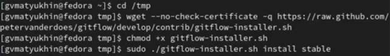
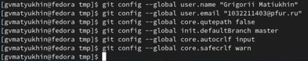
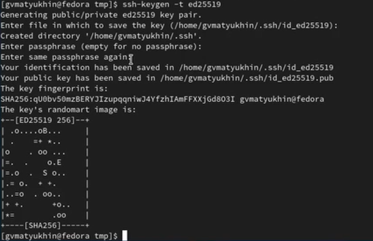
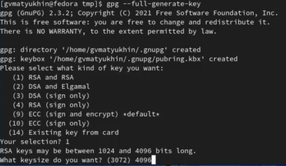
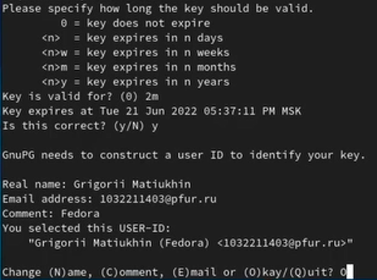
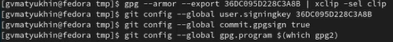
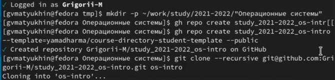
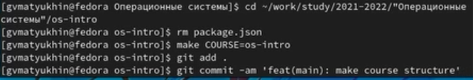

---
lang: ru-RU

fontsize: 12pt
linestretch: 1.5
papersize: a4

## Fonts
mainfont: PT Serif
romanfont: PT Serif
sansfont: PT Sans
monofont: PT Mono

---

МИНИСТЕРСТВО ОБРАЗОВАНИЯ И НАУКИ
РОССИЙСКОЙ ФЕДЕРАЦИИ

ФЕДЕРАЛЬНОЕ ГОСУДАРСТВЕННОЕ АВТОНОМНОЕ
ОБРАЗОВАТЕЛЬНОЕ УЧРЕЖДЕНИЕ ВЫСШЕГО ОБРАЗОВАНИЯ
"РОССИЙСКИЙ УНИВЕРСИТЕТ ДРУЖБЫ НАРОДОВ"

 

Факультет физико-математических и естественных наук

 

ОТЧЕТ

 

По лабораторной работе №2
"Система контроля версий"

 

Выполнил:
Студент группы: НПИбд-01-21
Студенческий билет: №1032211403
ФИО студента: Матюхин Григорий Васильевич
Дата выполнения: 30.04.2022

 

Москва 2022

# Цель работы:

1. Изучить идеологию и применение средств контроля версий.
2. Освоить умения по работе с git

# Задание:

1. Создать базовую конфигурацию для работы с git.
2. Создать ключ SSH.
3. Создать ключ GPG. 
4. Настроить подписи git.
5. Зарегистрироваться на Github.
6. Создать локальный каталог для выполнения заданий по предмету.

# Теоретическое введение:

Системы контроля версий (Version Control System, VCS) применяются при работе нескольких человек над одним проектом. Обычно основное дерево проекта хранится в локальном или удалённом репозитории, к которому настроен доступ для участников проекта. При внесении изменений в содержание проекта система контроля версий позволяет их фиксировать, совмещать изменения, произведённые разными участниками проекта, производить откат к любой более ранней версии проекта, если это требуется.
В классических системах контроля версий используется централизованная модель, предполагающая наличие единого репозитория для хранения файлов. Выполнение большинства функций по управлению версиями осуществляется специальным сервером. Участник проекта (пользователь) перед началом работы посредством определённых команд получает нужную ему версию файлов. После внесения изменений, пользователь размещает новую версию в хранилище. При этом предыдущие версии не удаляются из центрального хранилища и к ним можно вернуться в любой момент. Сервер может сохранять не полную версию изменённых файлов, а производить так называемую дельтакомпрессию — сохранять только изменения между последовательными версиями, что позволяет уменьшить объём хранимых данных.
Системы контроля версий поддерживают возможность отслеживания и разрешения конфликтов, которые могут возникнуть при работе нескольких человек над одним файлом. Можно объединить (слить) изменения, сделанные разными участниками (автоматически или вручную), вручную выбрать нужную версию, отменить изменения вовсе или заблокировать файлы для изменения. В зависимости от настроек блокировка не позволяет другим пользователям получить рабочую копию или препятствует изменению рабочей копии файла средствами файловой системы ОС, обеспечивая таким образом, привилегированный доступ только одному пользователю, работающему с файлом.
Системы контроля версий также могут обеспечивать дополнительные, более гибкие функциональные возможности. Например, они могут поддерживать работу с несколькими версиями одного файла, сохраняя общую историю изменений до точки ветвления версий и собственные истории изменений каждой ветви. Кроме того, обычно доступна информация о том, кто из участников, когда и какие изменения вносил. Обычно такого рода информация хранится в журнале изменений, доступ к которому можно ограничить.
В отличие от классических, в распределённых системах контроля версий центральный репозиторий не является обязательным.
Среди классических VCS наиболее известны CVS, Subversion, а среди распределённых — Git, Bazaar, Mercurial. Принципы их работы схожи, отличаются они в основном синтаксисом используемых в работе команд.
 
# Выполнение лабораторной работы:

1. Установка git-flow и gh в Fedora Linux

2. Базовая настройка git

3. Создание ключей ssh

4. Создание ключей gpg

6. Настройка автоматических подписей коммитов git

7. Настройка gh  и сознание репозитория курса на основе шаблона

# Выводы:

В процессе выполнения задания были приобретены навыки по оформлению отчетов с помощью легковесного языка разметки Markdown.

# Ответы на контрольные вопросы:

1. Система управления версиями (система контроля версий) -- программное обеспечение для облегчения работы с изменяющейся информацией. Система управления версиями позволяет хранить несколько версий одного и того же документа, при необходимости возвращаться к более ранним версиям, определять, кто и когда сделал то или иное изменение, и многое другое.
2. Определения
	1. Хранилище документов -- место, где система управления версиями хранит все документы вместе с историей их изменения и другой служебной информацией.
	2.  Commit -- создание новой версии, фиксация изменений.
	3. История -- набор изменений. Представляет собой поименованный набор правок, сделанных в локальной копии для какой-то общей цели.
	4. Рабочая версия -- локальная копия документов.
3. Системы контроля версий можно разделить на две группы: распределенные и централизованные.
	1. Централизованные системы контроля версий представляют собой приложения типа клиент-сервер, когда репозиторий проекта существует в единственном экземпляре и хранится на сервере. Доступ к нему осуществлялся через специальное клиентское приложение. В качестве примеров таких программных продуктов можно привести CVS, Subversion.
	2. Распределенные системы контроля версий (_Distributed Version Control System, DVCS_) позволяют хранить репозиторий (его копию) у каждого разработчика, работающего с данной системой. При этом можно выделить центральный репозиторий (условно), в который будут отправляться изменения из локальных и, с ним же эти локальные репозитории будут синхронизироваться. При работе с такой системой, пользователи периодически синхронизируют свои локальные репозитории с центральным и работают непосредственно со своей локальной копией. После внесения достаточного количества изменений в локальную копию они (изменения) отправляются на сервер. При этом сервер, чаще всего, выбирается условно, т.к. в большинстве _DVCS_ нет такого понятия как “выделенный сервер с центральным репозиторием”. Две наиболее известные _DVCS_ – это _Git_ и _Mercurial_.
4. Действия с VCS при единоличной работе с хранилищем
	1. Модификация проекта
	2. Фиксация изменений
5. Порядок работы с общим хранилищем VCS
	1. Обновление рабочей копии
	2. Модификация проекта
	3. Фиксация изменений
6. Систематизация, параллельность разработки программного обеспечения, единое место для хранение файлов проекта
7. Создание репозитория (`git init`), Клонирование репозитория (`git clone`), Добавление изменений в индекс (`git add`), Удаление изменений из индекса (`git reset`), Коммиты (`git commit`), Удаление файла (`git rm`).
8. Для написания черновых работ по лабораторным работам я использую локальные репозитории, для их распространения или для оценивания преподователем я использую удаленный репозиторий `git`
9. Ветви служат для параллельной разработки программного обеспечения, тестирования, отладки и улучшения
10. Игнорирование можно установить для проекта, компьютера и репозитория, цель игнорирования заключается в том, чтобы не отслеживать файлы служебного типа, например временные файлы сборных утилит для проектов или только те файлы которые полезны при взаимодействии только с очень ограниченным программным обеспечением 
