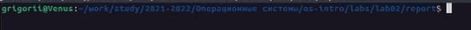
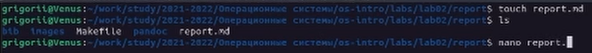
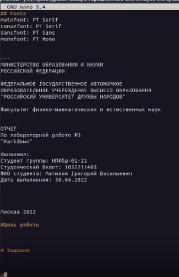
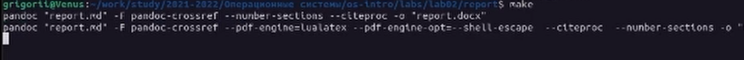
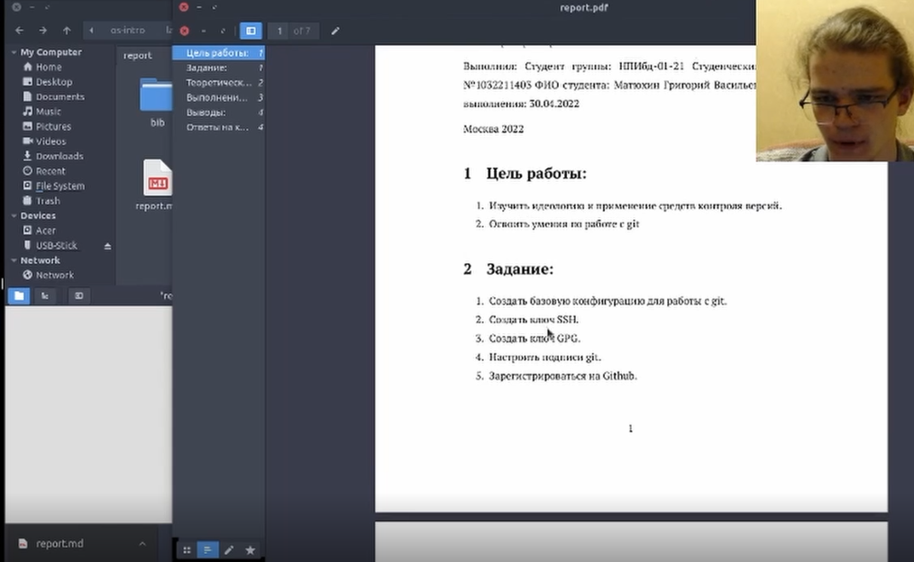

---
## Front matter
lang: ru-RU
title: Лабораторная работа №3. Markdown

## Formatting
toc: false
slide_level: 2
theme: metropolis
header-includes: 
 - \metroset{progressbar=frametitle,sectionpage=progressbar,numbering=fraction}
 - '\makeatletter'
 - '\beamer@ignorenonframefalse'
 - '\makeatother'
aspectratio: 43
section-titles: true
---
## Цель работы:

- Научиться оформлять отчёты с помощью легковесного языка разметки Markdown.

## Задание:

- Сделайте отчёт по предыдущей лабораторной работе в формате Markdown.

## Теоретическое введение:

Markdown -- это облегченный язык текстовой разметки документов. Его придумали в 2004 году блогер Джон Грубер и интернет-активист Аарон Шварц, чтобы быстро форматировать статьи. Требования к языку были следующими:
- Чем проще — тем лучше.
- Документы с этой разметкой можно перевести в красиво отформатированный вид, как на веб-странице.
- Исходный текст материала должен оставаться читаемым даже без преобразования в веб-страницу.

# Выполнение лабораторной работы:

## Выбрать или создать новую папку, в которой создадим файл формата .md, а также папку с изображениями.

## Перейдем в созданную папку. В ней создадим файл формата .md, в котором мы будем работать.

## Используя текстовый редактор, редактируем и сохраняем файл формата .md.

## Используя имеющийся Makefile создадим файлы форматов docx. и pdf.

## Проверим полученные файлы на ошибки.

## Выводы: 

В процессе выполнения задания были приобретены навыки по оформлению отчетов с помощью легковесного языка разметки Markdown.
