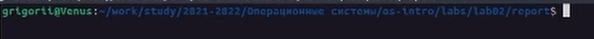
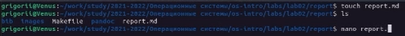
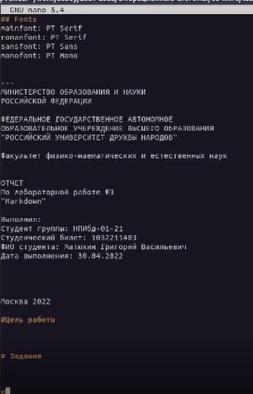
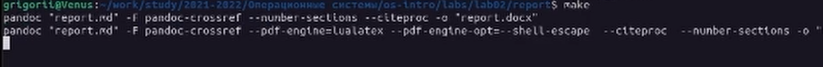
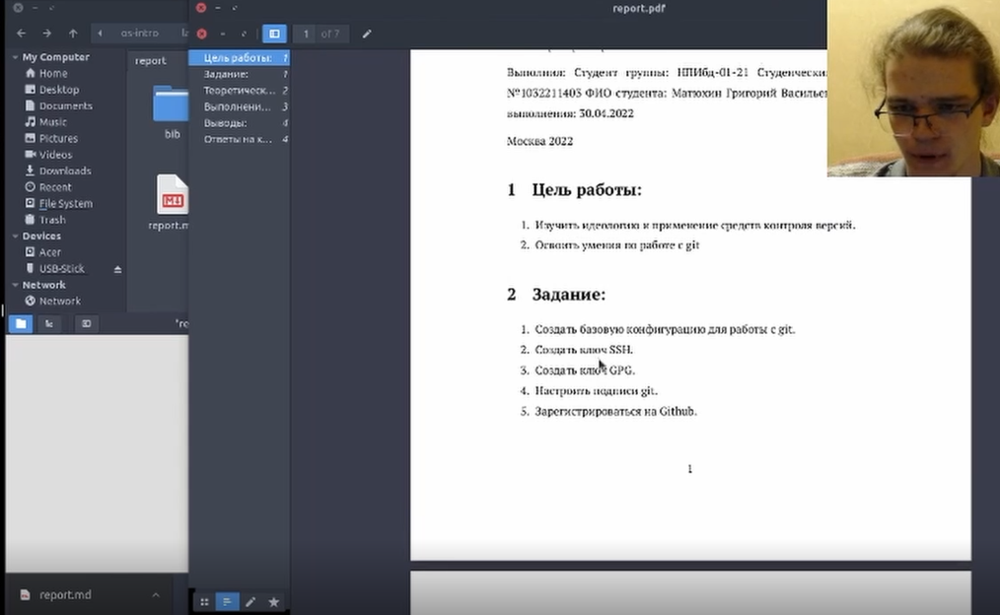

---
lang: ru-RU

fontsize: 12pt
linestretch: 1.5
papersize: a4

## Fonts
mainfont: PT Serif
romanfont: PT Serif
sansfont: PT Sans
monofont: PT Mono

---

МИНИСТЕРСТВО ОБРАЗОВАНИЯ И НАУКИ
РОССИЙСКОЙ ФЕДЕРАЦИИ

ФЕДЕРАЛЬНОЕ ГОСУДАРСТВЕННОЕ АВТОНОМНОЕ
ОБРАЗОВАТЕЛЬНОЕ УЧРЕЖДЕНИЕ ВЫСШЕГО ОБРАЗОВАНИЯ
"РОССИЙСКИЙ УНИВЕРСИТЕТ ДРУЖБЫ НАРОДОВ"

 

Факультет физико-математических и естественных наук

 

ОТЧЕТ

 

По лабораторной работе №3
"Markdown"

 

Выполнил:
Студент группы: НПИбд-01-21
Студенческий билет: №1032211403
ФИО студента: Матюхин Григорий Васильевич
Дата выполнения: 30.04.2022

 

Москва 2022

# Цель работы:

- Научиться оформлять отчёты с помощью легковесного языка разметки Markdown.

# Задание:

- Сделайте отчёт по предыдущей лабораторной работе в формате Markdown.

# Теоретическое введение:

Markdown -- это облегченный язык текстовой разметки документов. Его придумали в 2004 году блогер Джон Грубер и интернет-активист Аарон Шварц, чтобы быстро форматировать статьи. Требования к языку были следующими:
- Чем проще — тем лучше.
- Документы с этой разметкой можно перевести в красиво отформатированный вид, как на веб-странице.
- Исходный текст материала должен оставаться читаемым даже без преобразования в веб-страницу.

# Выполнение лабораторной работы:

1. Выбрать или создать новую папку, в которой создадим файл формата .md, а также папку с изображениями.

2. Перейдем в созданную папку. В ней создадим файл формата .md, в котором мы будем работать.

3. Используя текстовый редактор, редактируем и сохраняем файл формата .md.

4. Используя имеющийся Makefile создадим файлы форматов docx. и pdf.

5. Проверим полученные файлы на ошибки.

Проверяем работоспособность файлов

# Выводы:

В процессе выполнения задания были приобретены навыки по оформлению отчетов с помощью легковесного языка разметки Markdown.
