---
lang: ru-RU

fontsize: 12pt
linestretch: 1.5
papersize: a4

## Fonts
mainfont: PT Serif
romanfont: PT Serif
sansfont: PT Sans
monofont: PT Mono

---

МИНИСТЕРСТВО ОБРАЗОВАНИЯ И НАУКИ
РОССИЙСКОЙ ФЕДЕРАЦИИ

ФЕДЕРАЛЬНОЕ ГОСУДАРСТВЕННОЕ АВТОНОМНОЕ
ОБРАЗОВАТЕЛЬНОЕ УЧРЕЖДЕНИЕ ВЫСШЕГО ОБРАЗОВАНИЯ
"РОССИЙСКИЙ УНИВЕРСИТЕТ ДРУЖБЫ НАРОДОВ"

  

Факультет физико-математических и естественных наук

  

ОТЧЕТ

  

По лабораторной работе №5
"Markdown"

  

Выполнил:
Студент группы: НПИбд-01-21
Студенческий билет: №1032211403
ФИО студента: Матюхин Григорий Васильевич
Дата выполнения: 5.05.2022

  

Москва 2022

# Цель работы:

Ознакомление с файловой системой Linux, её структурой, именами и содержанием каталогов. Приобретение практических навыков по применению команд для работы с файлами и каталогами, по управлению процессами (и работами), по проверке использования диска и обслуживанию файловой системы.

# Выполнение лабораторной работы:

1. Выполните все примеры, приведённые в первой части описания лабораторной работы.
	1. Команда cp
		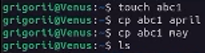
		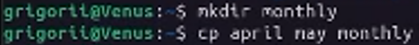
		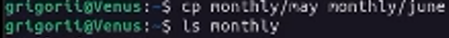
		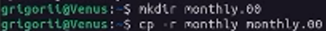
		
	2. Команда mv
		
		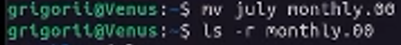
		
		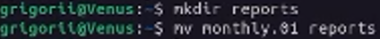
		
	3. Команда chmod
		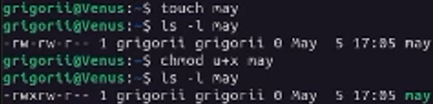
		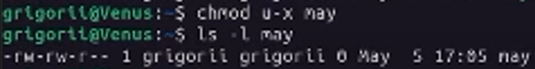
		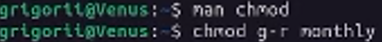
		
		
2. Выполните следующие действия, зафиксировав в отчёте по лабораторной работе
используемые при этом команды и результаты их выполнения:
	1. Скопируйте файл /usr/include/sys/io.h в домашний каталог и назовите его
equipment. Если файла io.h нет, то используйте любой другой файл в каталоге
/usr/include/sys/ вместо него.
	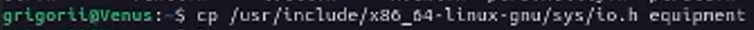
	2. В домашнем каталоге создайте директорию ~/ski.plases.
	
	3. Переместите файл equipment в каталог ~/ski.plases.
	
	4. Переименуйте файл ~/ski.plases/equipment в ~/ski.plases/equiplist.
	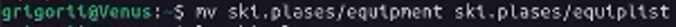
	5. Создайте в домашнем каталоге файл abc1 и скопируйте его в каталог ~/ski.plases, назовите его equiplist2.
	
	6. Создайте каталог с именем equipment в каталоге ~/ski.plases.
	
	7. Переместите файлы ~/ski.plases/equiplist и equiplist2 в каталог ~/ski.plases/equipment.
	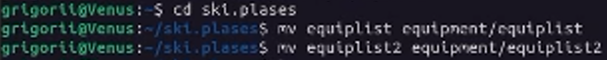
	8. Создайте и переместите каталог ~/newdir в каталог ~/ski.plases и назовите его plans.
	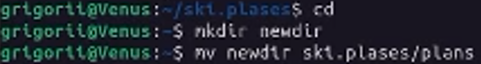
3. Определите опции команды chmod, необходимые для того, чтобы присвоить перечисленным ниже файлам выделенные права доступа, считая, что в начале таких прав нет (при необходимости создайте нужные файлы):
	1. `drwxr--r--` -- australia
	
	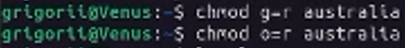
	2. `drwx--x--x` -- play
	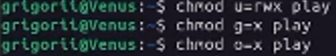
	3. `-r-xr--r--` -- my_os
	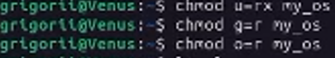
	4. `-rw-rw-r--` -- feathers
	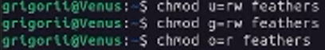
4. Проделайте приведённые ниже упражнения, записывая в отчёт по лабораторной работе используемые при этом команды:
	1. Просмотрите содержимое файла /etc/password.
	
	2. Скопируйте файл ~/feathers в файл ~/file.old.
	
	3. Переместите файл ~/file.old в каталог ~/play.
	
	4. Скопируйте каталог ~/play в каталог ~/fun.
	
	6. Лишите владельца файла ~/feathers права на чтение.
	
	7. Что произойдёт, если вы попытаетесь просмотреть файл ~/feathers командой cat?
	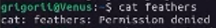
	8. Что произойдёт, если вы попытаетесь скопировать файл ~/feathers?
	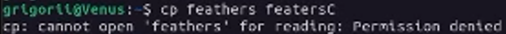
	9. Дайте владельцу файла ~/feathers право на чтение.
	
	10. Лишите владельца каталога ~/play права на выполнение.
	
	11. Перейдите в каталог ~/play. Что произошло?
	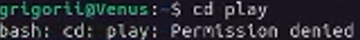
	12. Дайте владельцу каталога ~/play право на выполнение.
	
5. Прочитайте man по командам mount, fsck, mkfs, kill и кратко их охарактеризуйте, приведя примеры.

# Выводы: 

В ходе выполнения Лабораторной работы №5, были приобретены навыки по использованию команд, копирование каталогов и их удаление, перемещение файлов и каталогов, копирование файлов и каталогов

# Контрольные вопросы
1. Дайте характеристику каждой файловой системе, существующей на жёстком диске компьютера, на котором вы выполняли лабораторную работу.
+ EXT4 - Плюсы:
	+ Журналирование;
	+ Поддержка шифрования;
	+ Высокая стабильность, так как она проверена временем;
	+ Поддержка по умолчанию во многих дистрибутивах;
	+ Не подвержена фрагментации;
	+ Лимитов вполне достаточно обычному пользователю, так и для серверных систем;
+ EXT4 - Минусы:
	+ Не поддерживаются функции файловых систем следующего поколения, такие как управление томами, дедупликация данных;
	+ Отсутствие проверки контрольных сумм для данных, что делает невозможным обнаружение повреждения данных из-за аппаратных сбоев оборудования.
	+ Плохая масштабируемость
+ NTFS - Плюсы:
	+ Фрагментация файлов не имеет практически никаких последствий для самой файловой системы – работа фрагментированной системы ухудшается только с точки зрения доступа к самим данным файлов.
	+ Сложность структуры каталогов и число файлов в одном каталоге также не чинит особых препятствий быстродействию.
	+ Быстрый доступ к произвольному фрагменту файла
	+ Очень быстрый доступ к маленьким файлам (несколько сотен байт) – весь файл находится в том же месте, где и системные данные (запись MFT).
+ NTFS - Минусы: 
	+ Существенные требования к памяти системы (64 Мбайт – абсолютный минимум, лучше – больше).
	+ Медленные диски и контроллеры без Bus Mastering сильно снижают быстродействие NTFS.
	+ Работа с каталогами средних размеров затруднена тем, что они почти всегда фрагментированы.
	+ Диск, долго работающий в заполненном на 80% – 90% состоянии, будет показывать крайне низкое быстродействие.
2. Приведите общую структуру файловой системы и дайте характеристику каждой директории первого уровня этой структуры.
	+ `/bin` - Основные программы, необходимые для работы в системе
	+ `/boot` - Содержит ядро системы — главную программу, загружающую и исполняющую все остальные
	+ `/dev` - Каталог, в котором содержатся псевдофайлы устройств
	+ `/etc` - В этом каталоге содержатся системные конфигурационные файлы
	+ `/home` - В структуре файловой системы Linux каждый пользователь имеет отдельный личный каталог для своих данных
	+ `/mnt` - Каталоги для монтирования файловых систем сменных устройств и внешних файловых систем
	+ `/proc` - Файловая система на виртуальном устройстве, её файлы содержат информацию о текущем состоянии системы
	+ `/root` - Каталог администратора системы
	+ `/sbin` - Системные утилиты
	+ `/usr` - Программы и библиотеки, доступные пользователю
	+ `/var` - Рабочие файлы программ, различные временные данные
	+ `/tmp` - Временные файлы
3. Какая операция должна быть выполнена, чтобы содержимое некоторой файловой системы было доступно операционной системе?
	+ Чтобы содержимое некоторой файловой системы было доступно операционной системе должно быть выполнено монтирование тома стандартными или внешними средствами операционной системы
4. Назовите основные причины нарушения целостности файловой системы. Как устранить повреждения файловой системы?
	+ Один блок адресуется несколькими `mode`
	+ Блок помечен как свободный, но в то же время занят
	+ Блок помечен как занятый, но в то же время свободен
	+ Неправильное число ссылок в inode
	+ Несовпадение между размером файла и суммарным размером адресуемых inode блоков.
	+ Недопустимые адресуемые блоки
	+ Потерянные или недоступные файлы
	Чтобы устранить повреждения файловой системы используется команда `fsck`
5. Как создаётся файловая система?
	Утилита `mkfs` создаёт новую файловую систему.
6. Дайте характеристику командам для просмотра текстовых файлов.
	+ для просмотра небольших файлов - `cat`
	+ для просмотра больших файлов - `less` — она позволяет осуществлять постраничный просмотр файлов
	+ для просмотра начала файла - `head[-n]`, по умолчанию она выводит первые 10 строк файла
	+ команда `tail[-n]` выводит несколько последних строк файла
7. Приведите основные возможности команды cp в Linux.
	+ копирование файла в текущем каталоге
	+ копирование нескольких файлов в каталог
	+ копирование файлов в произвольном каталоге
	+ `-i` в команде `cp` выведет на экран запрос подтверждения о перезаписи файла, если на место целевого файла вы поставите имя уже существующего файла.
8. Приведите основные возможности команды mv в Linux.
	+ Команды mv и mvdir предназначены для перемещения и переименования файлов и каталогов
	+ Формат команды: mv [-option] старый\_файл новый\_файл
9. Что такое права доступа? Как они могут быть изменены? При ответах на вопросы используйте дополнительные источники информации по теме.
	Права доступа определяют, кто и что может делать с содержимым файла. Существуют 	три группы прав доступа: для владельца файла, для членов группы, для всех остальных. 	Для изменения прав доступа к файлу или каталогу используется команда chmod. Права 	доступа к файлу может поменять только владелец или суперпользователь (`sudo` or `su`). 	Команда `sudo chmod` имеет следующую структуру и способ записи:
	+ `u (user) владелец файла`
	+ `g (group) группа, к которой принадлежит владелец файла`
	+ `o (others) все остальные`
	+ `= установить право`
	+ `- лишить права`
	+ `+ дать право`
	+ `r - чтение`
	+ `w - запись`
	+ `x - выполнение`
