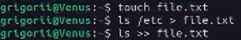

---
lang: ru-RU

fontsize: 12pt
linestretch: 1.5
papersize: a4

## Fonts
mainfont: PT Serif
romanfont: PT Serif
sansfont: PT Sans
monofont: PT Mono

---

МИНИСТЕРСТВО ОБРАЗОВАНИЯ И НАУКИ
РОССИЙСКОЙ ФЕДЕРАЦИИ

ФЕДЕРАЛЬНОЕ ГОСУДАРСТВЕННОЕ АВТОНОМНОЕ
ОБРАЗОВАТЕЛЬНОЕ УЧРЕЖДЕНИЕ ВЫСШЕГО ОБРАЗОВАНИЯ
"РОССИЙСКИЙ УНИВЕРСИТЕТ ДРУЖБЫ НАРОДОВ"

  

Факультет физико-математических и естественных наук

  

ОТЧЕТ

  

По лабораторной работе №6
"Markdown"

  

Выполнил:
Студент группы: НПИбд-01-21
Студенческий билет: №1032211403
ФИО студента: Матюхин Григорий Васильевич
Дата выполнения: 5.05.2022

  

Москва 2022

# Цель работы:

Ознакомление с инструментами поиска файлов и фильтрации текстовых данных. Приобретение практических навыков: по управлению процессами (и заданиями), по проверке использования диска и обслуживанию файловых систем.

# Выполнение лабораторной работы

1. Осуществите вход в систему, используя соответствующее имя пользователя.
2. Запишите в файл file.txt названия файлов, содержащихся в каталоге /etc. Допишите в этот же файл названия файлов, содержащихся в вашем домашнем каталоге.

3. Выведите имена всех файлов из file.txt, имеющих расширение .conf, после чего запишите их в новый текстовой файл conf.txt.
 
4. Определите, какие файлы в вашем домашнем каталоге имеют имена, начинавшиеся с символа c? Предложите несколько вариантов, как это сделать.
 
5. Выведите на экран (по-странично) имена файлов из каталога /etc, начинающиеся с символа h.
 
6. Запустите в фоновом режиме процесс, который будет записывать в файл ~/logfile файлы, имена которых начинаются с log.
 
7. Удалите файл ~/logfile.
 
8. Запустите из консоли в фоновом режиме редактор gedit.
 
9. Определите идентификатор процесса gedit, используя команду ps, конвейер и фильтр grep. Как ещё можно определить идентификатор процесса?
 
10. Прочтите справку (man) команды kill, после чего используйте её для завершения процесса gedit.
 
11. Выполните команды df и du, предварительно получив более подробную информацию об этих командах, с помощью команды man.
 
 
12. Воспользовавшись справкой команды find, выведите имена всех директорий, имеющихся в вашем домашнем каталоге.
 

# Вывод

В ходе работы я ознакомился с инструментами поиска файлов и фильтрации текстовых данных и приобрел практические навыки: по управлению процессами (и заданиями), по проверке использования диска и обслуживанию файловых систем.

# Контрольные вопросы
1. Какие потоки ввода вывода вы знаете?
	+ Существует всего три стандартных потока:
		+ `stdin` - стандартный поток ввода (клавиатура - файловый дескриптор 0)
		+ `stdout` - стандартный поток вывода (консоль - файловый дескриптор 1)
		+ `stderr` - стандартный поток вывода сообщений об ошибках (консоль - файловый дескриптор 2)
2. Объясните разницу между операцией > и >>.
	+ `>` - перенаправление stdout в файл. Если файл отсутствовал, то он создаётся, в противном случае - перезаписывается
	+ `>>` - перенаправление stdout в файл. Если файл отсутствовал, то он создаётся, иначе - добавляется
3. Что такое конвейер?
	+ Конвейер - инструмент для объединения простых команд или утилит в связные цепочки
4. Что такое процесс? Чем это понятие отличается от программы?
	+ Процесс - связь кода и данных, загруженных в ОЗУ/ПЗУ ЭВМ. К процессу также относится элементы которые взаимодействуют с программой - адресное пространство, глобальные переменные, регистры, стек и т.д. Программа - единица выполняемого процесса
5. Что такое PID и GID?
	+ PID — Personal ID, идентификатор процесса
	+ GID – Group ID, идентификатор группы
6. Что такое задачи и какая команда позволяет ими управлять?
	+ Программы запущенные в фоне называются задачами - jobs. Ими можно управлять с помощью команды jobs, которая выводит список запущенных в данный момент задач. Для завершения задачи необходимо выполнить команду `kill  %номер задачи`
7. Найдите информацию об утилитах top и htop. Каковы их функции?
	+  `htop` — монитор процессов, показывает динамический список системных процессов, список обычно выравнивается по использованию ЦПУ
8. Назовите и дайте характеристику команде поиска файлов. Приведите примеры использования этой команды.
	+ `find` - используется для поиска и отображения имён файлов. Формат команды: `find путь [-опции]` - `find /home1/home2/ -%имя% "p*" -print`
9. Можно ли по контексту (содержанию) найти файл? Если да, то как?
	+ `grep` - используется для поиска файла по контексту - `grep %string% %name%`
10. Как определить объем свободной памяти на жёстком диске?
	+ `f` - позволяет определить объем свободной памяти на жёстком диске
11. Как определить объем вашего домашнего каталога?
	+ `df /home/%user_name%` - позволяет определить объем домашнего каталога
12. Как удалить зависший процесс
	+ Удалить зависший процесс можно командой `kill %номер задачи%`
