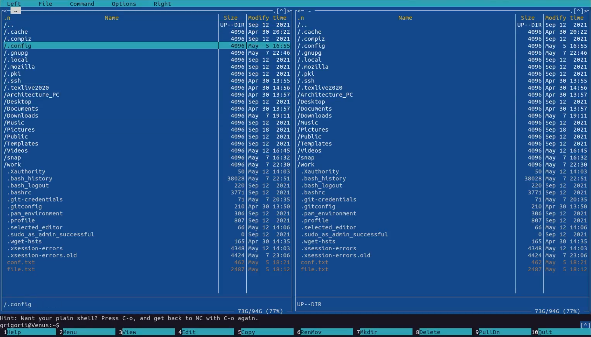
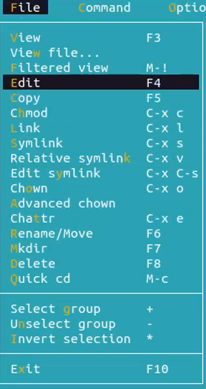
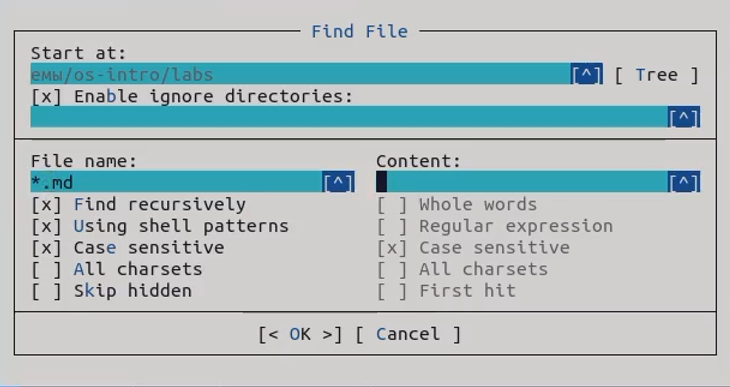
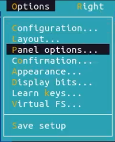
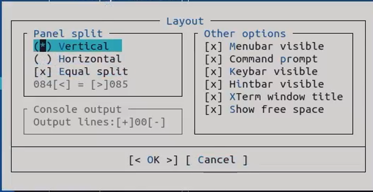
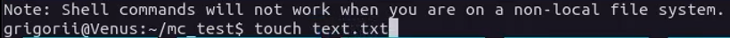
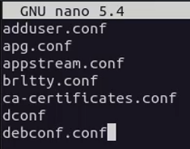
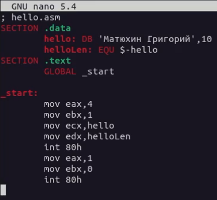
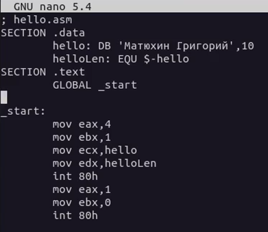

---
lang: ru-RU

fontsize: 12pt
linestretch: 1.5
papersize: a4

## Fonts
mainfont: PT Serif
romanfont: PT Serif
sansfont: PT Sans
monofont: PT Mono

---

МИНИСТЕРСТВО ОБРАЗОВАНИЯ И НАУКИ
РОССИЙСКОЙ ФЕДЕРАЦИИ

ФЕДЕРАЛЬНОЕ ГОСУДАРСТВЕННОЕ АВТОНОМНОЕ
ОБРАЗОВАТЕЛЬНОЕ УЧРЕЖДЕНИЕ ВЫСШЕГО ОБРАЗОВАНИЯ
"РОССИЙСКИЙ УНИВЕРСИТЕТ ДРУЖБЫ НАРОДОВ"

  

Факультет физико-математических и естественных наук

  

ОТЧЕТ

  

По лабораторной работе №7
"Командная оболочка Midnight Commander"

  

Выполнил:
Студент группы: НПИбд-01-21
Студенческий билет: №1032211403
ФИО студента: Матюхин Григорий Васильевич
Дата выполнения: 12.05.2022

  

Москва 2022
\pagebreak

# Цель работы:

Освоение основных возможностей командной оболочки Midnight Commander. Приобретение навыков практической работы по просмотру каталогов и файлов; манипуляций с ними.

# Теоретическое введение:

Командная оболочка — интерфейс взаимодействия пользователя с операционной системой и программным обеспечением посредством команд. Midnight Commander (или mc) — псевдографическая командная оболочка для UNIX/Linux систем.

# Выполнение лабораторной работы

## Задания по mc

1. Изучите информацию о mc, вызвав в командной строке man mc.

2. Запустите из командной строки mc, изучите его структуру и меню.

3. Выполните несколько операций в mc, используя управляющие клавиши (операции с панелями; выделение/отмена выделения файлов, копирование/перемещение файлов, получение информации о размере и правах доступа на файлы и/или каталоги и т.п.)
4. Выполните основные команды меню левой (или правой) панели. Оцените степень подробности вывода информации о файлах.
5. Используя возможности подменю Файл , выполните:
	+ просмотр содержимого текстового файла;
	+ редактирование содержимого текстового файла (без сохранения результатов редактирования);
	+ создание каталога;
	+ копирование в файлов в созданный каталог.
	
6. С помощью соответствующих средств подменю Команда осуществите:
	+ поиск в файловой системе файла с заданными условиями (например, файла с расширением .c или .cpp, содержащего строку main);
	+ выбор и повторение одной из предыдущих команд;
	+ переход в домашний каталог;
	+ анализ файла меню и файла расширений.
	
7. Вызовите подменю Настройки. Освойте операции, определяющие структуру экрана mc (Full screen, Double Width, Show Hidden Files и т.д.).

## Задания по встроенному редактору mc

1. Создайте текстовой файл text.txt.

2. Откройте этот файл с помощью встроенного в mc редактора.
3. Вставьте в открытый файл небольшой фрагмент текста, скопированный из любого другого файла или Интернета.

4. Проделайте с текстом следующие манипуляции, используя горячие клавиши:
	1. Удалите строку текста.
	2. Выделите фрагмент текста и скопируйте его на новую строку. 
	3. Выделите фрагмент текста и перенесите его на новую строку.
	4. Сохраните файл.
	5. Отмените последнее действие.
	6. Перейдите в конец файла (нажав комбинацию клавиш) и напишите некоторый текст.
	7. Перейдите в начало файла (нажав комбинацию клавиш) и напишите некоторый текст.
	8. Сохраните и закройте файл.
5. Откройте файл с исходным текстом на некотором языке программирования (например C или Java)

6. Используя меню редактора, включите подсветку синтаксиса, если она не включена, или выключите, если она включена.

# Вывод

В процессе работы я освоил основные возможности командной оболочки Midnight Commander. Приобрел навыки практической работы по просмотру каталогов и файлов; манипуляций с ними.

# Контрольные вопросы

1. Какие режимы работы есть в mc. Охарактеризуйте их.
	+ Режим "Информация" - на панель выводится информация о подсвеченном в другой панели файле и о текущей файловой системе
	+ Режим "Дерево" - в одной из панелей выводится графическое изображение структуры дерева каталогов
2. Какие операции с файлами можно выполнить как с помощью команд shell, так и с помощью меню (комбинаций клавиш) mc? Приведите несколько примеров.
	+ `F1`- Вызывает контекстно-зависимую подсказку
	+ `F2` - Вызывает меню, создаваемое пользователем. Оно позволяет создавать и добавлять дополнительные функции
	+ `F3` - Просмотр файла, на который указывает подсветка в активной панели
	+ `F4` - Вызов встроенного редактора для файла, на который указывает подсветка в активной панели
	+ `F5`- Копирование файла или группы отмеченных файлов из каталога, отображаемого в активной панели, в каталог, отображаемый на второй панели. При копировании одного файла можно поменять его имя
	+ `F6` - Перенос файла или группы отмеченных файлов из каталога, отображаемого в активной панели, в каталог, отображаемый на второй панели. Как и при копировании, можно поменять имя файла или целого каталога
	+ `F7` - Создание подкаталога в каталоге, отображаемом в активной панели
	+ `F8`- Удаление файла (подкаталога) или группы отмеченных файлов
	+ `F9` - Вызов основного меню программы (отображаемого над панелями)
	+ `F10` - Выход из программы
3. Опишите структура меню левой (или правой) панели mc, дайте характеристику командам.
	+ список файлов (этот режим используется для просмотра списка файлов).
	+ быстрый просмотр (в этом режиме панель переключается в режим вьюера, который показывает содержимое текущего файла; если выбрать эту панель (нажав клавишу Tab или при помощи мыши), то здесь можно пользоваться стандартными командами вьюера)
	+ информация (в этом режиме отображается информация, связанная с текущим файлом и, по возможности, информация о текущей файловой системе)
	+ дерево (этот режим идентичен функции отображения дерева каталогов)
	+ порядок сортировки (существует восемь типов сортировки файлов: по имени, по расширению, по времени последней модификации файла, по времени последнего доступа к файлу, по времени модификации индексного дескриптора, по размеру, по значению индексного дескриптора и без порядка. В диалоговом окне Sort order можно выбрать тип сортировки, а также указать, что сортировку следует производить в обратном порядке)
	+ фильтр (эта команда позволяет указать шаблон для файлов, которые должны отображаться; вне зависимости от шаблона, каталоги и ссылки к каталогам отображаются всегда)
4. Опишите структура меню `Файл` mc, дайте характеристику командам.
	+ `F3` - позволяет посмотреть содержимое текущего файла без возможности редактирования
	+ `F4` - открывает текущий файл для его редактирования
	+ `F5` - осуществляет копирование одного или нескольких файлов или каталогов в указанное место
	+ `Ctrl+x` `c` - позволяет изменить права доступа к одному или нескольким файлам или каталогам
	+ `Ctrl+x` `l` - позволяет создать жёсткую ссылку к текущему файлу
	+ `Ctrl+x` `s` - позволяет создать символическую ссылку к текущему файлу
	+ `Ctrl+x` `o` - позволяет задать владельца и имя группы для одного или нескольких файлов или каталогов
	+ `F6` - позволяет переименовать один или несколько файлов или каталогов
	+ `F7` - позволяет создать каталог
	+ `F8` - позволяет удалить один или несколько файлов или каталогов
	+ `F10` - завершает работу
5. Опишите структура меню `Команда` mc, дайте характеристику командам.
	+ дерево каталогов - отображает структуру каталогов системы
	+ поиск файла - выполняет поиск файлов по заданным параметрам
	+ переставить панели - меняет местами левую и правую панели
	+ сравнить каталоги - сравнивает содержимое двух каталогов
	+ размеры каталогов - отображает размер и время изменения каталога
	+ история командной строки - выводит на экран список ранее выполненных в оболочке команд
	+ каталоги быстрого доступа - при вызове выполняется быстрая смена текущего каталога на один из заданного списка
	+ восстановление файлов - позволяет восстановить файлы на файловых системах ext2 и ext3
	+ редактировать файл расширений - позволяет задать с помощью определённого синтаксиса действия при запуске файлов с определённым расширением
	+ редактировать файл меню — позволяет отредактировать контекстное меню пользователя, вызываемое по клавише `F2`
	+ редактировать файл расцветки имён — позволяет подобрать оптимальную для пользователя расцветку имён файлов в зависимости от их типа.
6. Опишите структура меню `Настройки` mc, дайте характеристику командам.
	+ Конфигурация позволяет скорректировать настройки работы с панелями
	+ Внешний вид и Настройки панелей определяет элементы, отображаемые при вызове MC, а также цветовое выделение
	+ Биты символов задаёт формат обработки информации локальным терминалом
	+ Подтверждение позволяет установить или убрать вывод окна с запросом подтверждения действий при определенных операциях
	+ Распознание клавиш диалоговое окно используется для тестирования клавиш
	+ Виртуальные ФС настройки виртуальной файловой системы
7. Назовите и дайте характеристику встроенным командам mc.
	+ `F1` - Вызов контекстно-зависимой подсказки
	+ `F2` - Вызов пользовательского меню с возможностью создания and/or
	+ `F3` - Просмотр содержимого файла, на который указывает подсветка в активной панели
	+ `F4` - Вызов встроенного в MC редактора для изменения содержания файла, на который указывает подсветка в активной панели
	+ `F5` - Копирование одного или нескольких файлов, отмеченных в первой (активной) панели, в каталог, отображаемый на второй панели
	+ `F6` - Перенос одного или нескольких файлов, отмеченных в первой панели, в каталог, отображаемый на второй панели
	+ `F7` - Создание подкаталога в каталоге, отображаемом в активной панели
	+ `F8` - Удаление одного или нескольких файлов, отмеченных в первой панели файлов
	+ `F9` - Вызов меню MC
	+ `F10` - Выход из MC
8. Назовите и дайте характеристику командам встроенного редактора mc.
	+ `Ctrl+Y` - удалить строку
	+ `Ctrl+U` - отмена последней операции
	+ `Ins` - вставка/замена
	+ `F7` - поиск
	+ `Shift+F7` - повтор последней операции поиска
	+ `F4` - замена файла
	+ `F3` - первое нажатие начало выделения, второе это окончание выделения
	+ `F5` - копировать выделенный фрагмент F6 переместить выделенный фрагмент
	+ `F8` - удалить выделенный фрагмент
	+ `F2`- записать изменения в файл
	+ `F10` - выйти из редактора
9. Дайте характеристику средствам mc, которые позволяют создавать меню, определяемые пользователем.
	+ Перейти в строку меню панелей MC можно с помощью клавиши `F9`. В строке меню имеются пять меню: Левая панель, Файл, Команда, Настройки и Правая панель. В меню каждой левой и правой панели можно выбрать "Формат списка":
		+ стандартный - выводит список файлов и каталогов с указанием размера и времени правки
		+ ускоренный - позволяет задать число столбцов, на которые разбивается панель при выводе списка имён файлов или каталогов без дополнительной информации
		+ расширенный - помимо названия файла или каталога выводит сведения о правах доступа, владельце, группе, размере, времени правки
		+ определённые пользователем - позволяет вывести те сведения о файле или каталоге, которые задаст пользователь
10. Дайте характеристику средствам mc, которые позволяют выполнять действия, определяемые пользователем, над текущим файлом.
	+ Все команды, содержащиеся в меню в левой или правой панели, файле, команде, и в настройках
