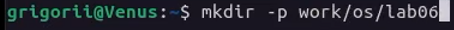
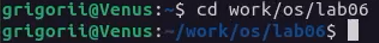
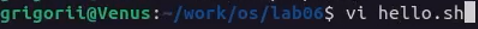
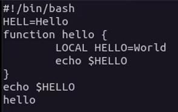
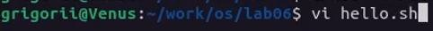
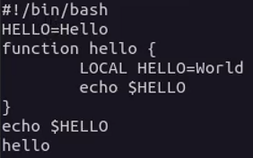
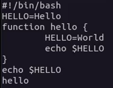
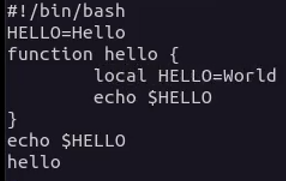
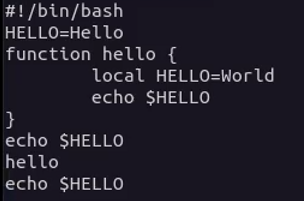
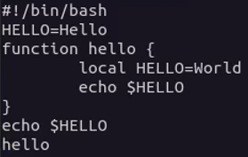


---
lang: ru-RU

fontsize: 12pt
linestretch: 1.5
papersize: a4

## Fonts
mainfont: PT Serif
romanfont: PT Serif
sansfont: PT Sans
monofont: PT Mono

---

МИНИСТЕРСТВО ОБРАЗОВАНИЯ И НАУКИ
РОССИЙСКОЙ ФЕДЕРАЦИИ

ФЕДЕРАЛЬНОЕ ГОСУДАРСТВЕННОЕ АВТОНОМНОЕ
ОБРАЗОВАТЕЛЬНОЕ УЧРЕЖДЕНИЕ ВЫСШЕГО ОБРАЗОВАНИЯ
"РОССИЙСКИЙ УНИВЕРСИТЕТ ДРУЖБЫ НАРОДОВ"

  

Факультет физико-математических и естественных наук

  

ОТЧЕТ

  

По лабораторной работе №8
"Текстовой редактор vi"

  

Выполнил:
Студент группы: НПИбд-01-21
Студенческий билет: №1032211403
ФИО студента: Матюхин Григорий Васильевич
Дата выполнения: 12.05.2022

  

Москва 2022
\pagebreak

# Цель работы:

Познакомиться с операционной системой Linux. Получить практические навыки работы с редактором vi, установленным по умолчанию практически во всех дистрибутивах.

# Выполнение лабораторной работы

1. Создайте каталог с именем ~/work/os/lab06.

2. Перейдите во вновь созданный каталог.

3. Вызовите vi и создайте файл hello.sh   
 `vi hello.sh`
 
4. Нажмите клавишу `i` и вводите следующий текст.
`#!/bin/bash  
HELL=Hello  
function hello {  
LOCAL HELLO=World  
echo $HELLO  
}  
echo $HELLO  
hello` 

5. Нажмите клавишу Esc для перехода в командный режим после завершения ввода текста.
6. Нажмите : для перехода в режим последней строки и внизу вашего экрана появится приглашение в виде двоеточия.
7. Нажмите w (записать) и q (выйти), а затем нажмите клавишу Enter для сохранения вашего текста и завершения работы.
8. Сделайте файл исполняемым `chmod +x hello.sh`

9. Вызовите vi на редактирование файла `vi ~/work/os/lab06/hello.sh`

10. Установите курсор в конец слова HELL второй строки.
11. Перейдите в режим вставки и замените на HELLO. Нажмите `Esc` для возврата в командный режим.

12. Установите курсор на четвертую строку и сотрите слово LOCAL.

14. Перейдите в режим вставки и наберите следующий текст: local, нажмите `Esc` для возврата в командный режим.

15. Установите курсор на последней строке файла. Вставьте после неё строку, содержащую следующий текст: echo $HELLO.

16. Нажмите `Esc` для перехода в командный режим.
17. Удалите последнюю строку.

18. Введите команду отмены изменений `u` для отмены последней команды.

19. Введите символ `:` для перехода в режим последней строки. Запишите произведённые изменения и выйдите из vi.

# Вывод

В процессе работы я познакомился с операционной системой Linux. Получил практические навыки работы с редактором vi, установленным по умолчанию практически во всех дистрибутивах.

# Контрольные вопросы

1. Дайте краткую характеристику режимам работы редактора vi.
	+ Редактор vi имеет три режима работы:
		+ командный режим — предназначен для ввода команд редактирования и навигации по редактируемому файлу;
		+ режим вставки — предназначен для ввода содержания редактируемого файла;
		+ режим последней (или командной) строки — используется для записи изменений в файл и выхода из редактора.
2. Как выйти из редактора, не сохраняя произведённые изменения?
	+ Необходимо перейти в режим последней строки: находясь в командном режиме, нажать `Shift+;`;
	+ набрать символ `q` `!`.
4. Назовите и дайте краткую характеристику командам позиционирования.
	+ `0` — переход в начало строки;
	+ `$` — переход в конец строки;
	+ `G` — переход в конец файла;
	+ n `G` — переход на строку с номером n.
5. Что для редактора vi является словом?
	+ При использовании прописных W и B под разделителями между словами понимаются только пробел, табуляция и возврат каретки.
	+ При использовании строчных w и b под разделителями понимаются также любые знаки пунктуации.
6. Каким образом из любого места редактируемого файла перейти в начало (конец) файла?
	+ `G` — переход в конец файла;
7. Назовите и дайте краткую характеристику основным группам команд редактирования.
	+ Команды редактирования
		+ Вставка текста
		+ Вставка строки
		+ Удаление текста
		+ Отмена и повтор произведённых изменений
		+ Копирование текста в буфер
		+ Вставка текста из буфера
		+ Замена текста
		+ Поиск текста
8. Необходимо заполнить строку символами `$`. Каковы ваши действия?
	1. `0` — переход в начало строки;
	2. `c` `$` — заменить текст от курсора до конца строки;
9. Как отменить некорректное действие, связанное с процессом редактирования?
	+ `u` — отменить последнее изменение;
10. Назовите и дайте характеристику основным группам команд режима командной строки.
	+ Команды редактирования в режиме командной строки
		+ Копирование и перемещение текста
		+ Запись в файл и выход из редактора
11. Как определить, не перемещая курсора, позицию, в которой заканчивается строка
12. Выполните анализ опций редактора vi (сколько их, как узнать их назначение и т.д.).
13. Как определить режим работы редактора vi?
14. Постройте граф взаимосвязи режимов работы редактора vi.
