---
## Front matter
lang: ru-RU
title: Лабораторная работа №10. Текстовой редактор emacs

## Formatting
toc: false
slide_level: 2
theme: metropolis
header-includes: 
 - \metroset{progressbar=frametitle,sectionpage=progressbar,numbering=fraction}
 - '\makeatletter'
 - '\beamer@ignorenonframefalse'
 - '\makeatother'
aspectratio: 43
section-titles: true
---

# Цель работы:

Познакомиться с операционной системой Linux. Получить практические навыки работы с редактором Emacs.

# Выполнение лабораторной работы

## Создать и сохранить файл
`#!/bin/bash
HELL=Hello
function hello {
	LOCAL HELLO=World
	echo $HELLO
}
echo $HELLO
hello`
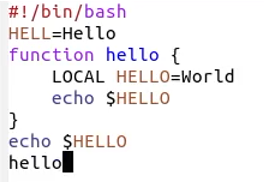

## Проделать с текстом стандартные процедуры редактирования, каждое действие должно осуществляться комбинацией клавиш.
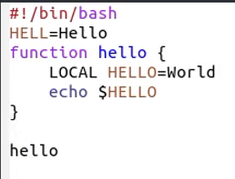
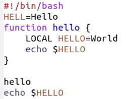
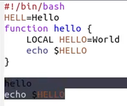
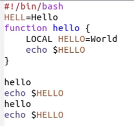
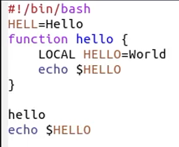
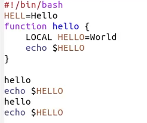

## Управление буферами.
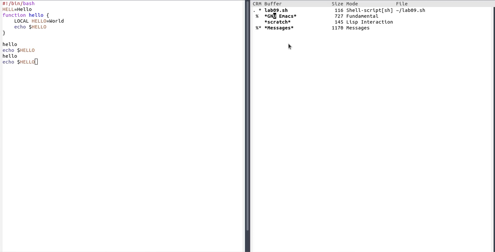
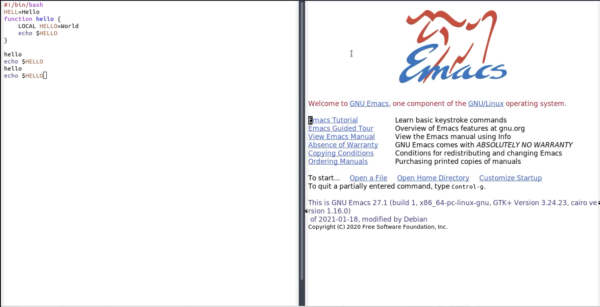
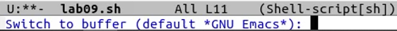

## Управление окнами.
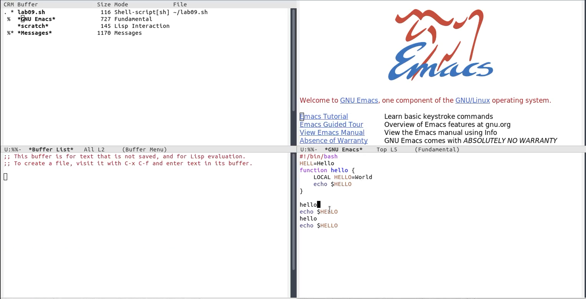

## Режим поиска
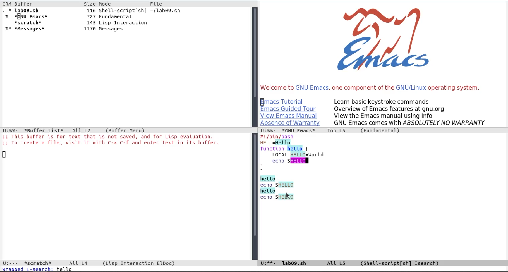

# Вывод

В процессе работы я познакомился с операционной системой Linux. Получил практические навыки работы с редактором emacs.
