
---
lang: ru-RU

fontsize: 12pt
linestretch: 1.5
papersize: a4

## Fonts
mainfont: PT Serif
romanfont: PT Serif
sansfont: PT Sans
monofont: PT Mono

---

МИНИСТЕРСТВО ОБРАЗОВАНИЯ И НАУКИ
РОССИЙСКОЙ ФЕДЕРАЦИИ

ФЕДЕРАЛЬНОЕ ГОСУДАРСТВЕННОЕ АВТОНОМНОЕ
ОБРАЗОВАТЕЛЬНОЕ УЧРЕЖДЕНИЕ ВЫСШЕГО ОБРАЗОВАНИЯ
"РОССИЙСКИЙ УНИВЕРСИТЕТ ДРУЖБЫ НАРОДОВ"

  

Факультет физико-математических и естественных наук

  

ОТЧЕТ

  

По лабораторной работе №9
"Текстовой редактор emacs"

  

Выполнил:
Студент группы: НПИбд-01-21
Студенческий билет: №1032211403
ФИО студента: Матюхин Григорий Васильевич
Дата выполнения: 19.05.2022

  

Москва 2022
\pagebreak

# Цель работы:

Познакомиться с операционной системой Linux. Получить практические навыки работы с редактором Emacs.

# Выполнение лабораторной работы

1. Открыть emacs.
2. Создать файл lab07.sh с помощью комбинации `C-x` `C-f`.
3. Наберите текст:
`#!/bin/bash
HELL=Hello
function hello {
	LOCAL HELLO=World
	echo $HELLO
}
echo $HELLO
hello`
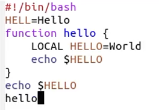
4. Сохранить файл с помощью комбинации (`C-x` `C-s`).
5. Проделать с текстом стандартные процедуры редактирования, каждое действие должно осуществляться комбинацией клавиш.
	1. Вырезать одной командой целую строку (`С-k`).
	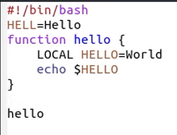
	2. Вставить эту строку в конец файла (`C-y`).
	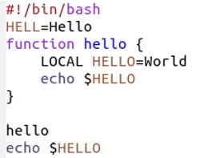
	3. Выделить область текста (`C-space`).
	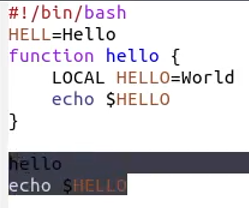
	4. Скопировать область в буфер обмена (`M-w`).
	5. Вставить область в конец файла.
	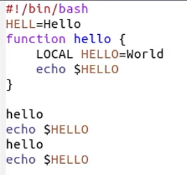
	6. Вновь выделить эту область и на этот раз вырезать её (`C-w`).
	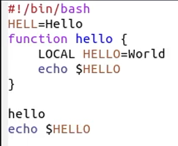
	7. Отмените последнее действие (`C-/`).
	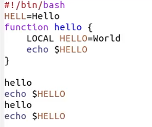
6. Научитесь использовать команды по перемещению курсора.
	1. Переместите курсор в начало строки (`C-a`).
	2. Переместите курсор в конец строки (`C-e`).
	3. Переместите курсор в начало буфера (`M-<`).
	4. Переместите курсор в конец буфера (`M->`).
7. Управление буферами.
	1. Вывести список активных буферов на экран (`C-x` `C-b`).
	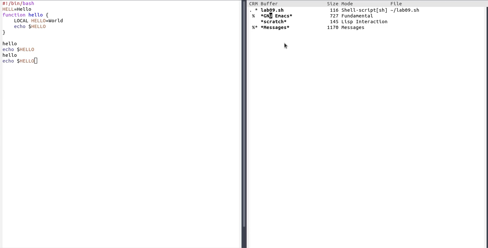
	2. Переместитесь во вновь открытое окно (`C-x`) o со списком открытых буферов и переключитесь на другой буфер.
	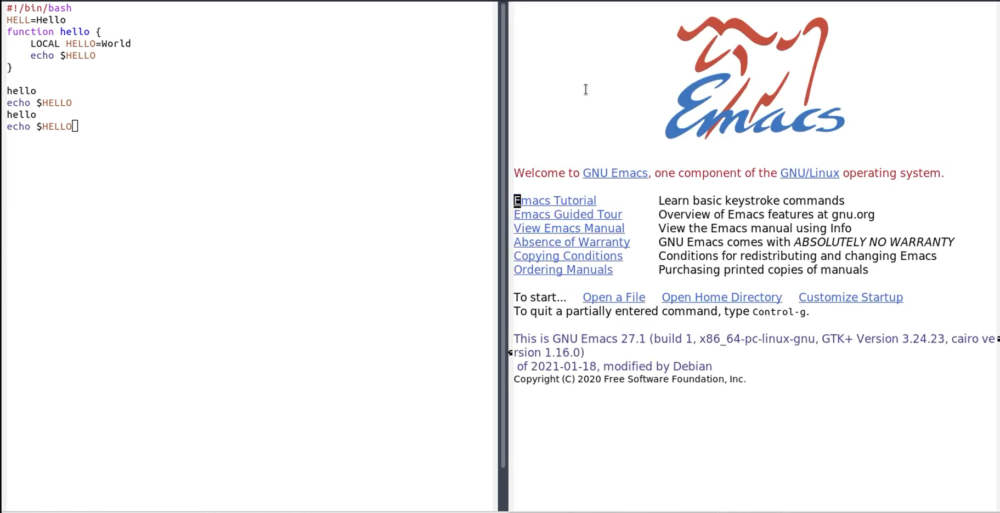
	3. Закройте это окно (`C-x 0`).
	4. Теперь вновь переключайтесь между буферами, но уже без вывода их списка на экран (`C-x b`).
	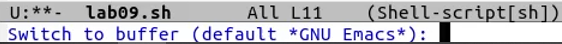
8. Управление окнами.
	1. Поделите фрейм на 4 части: разделите фрейм на два окна по вертикали (`C-x 3`), а затем каждое из этих окон на две части по горизонтали (`C-x 2`).
	2. В каждом из четырёх созданных окон откройте новый буфер (файл) и введите несколько строк текста.
	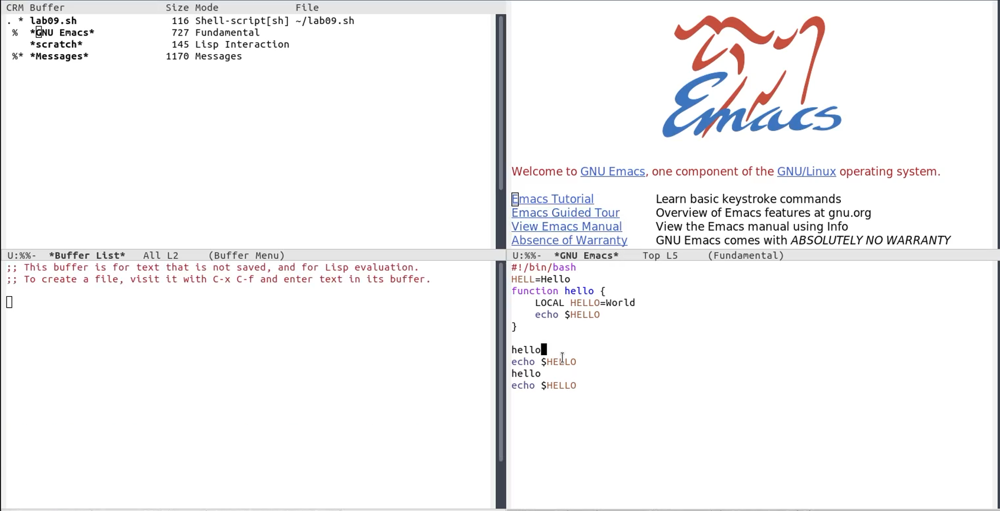
9. Режим поиска
	1. Переключитесь в режим поиска (`C-s`) и найдите несколько слов, присутствующих в тексте.
	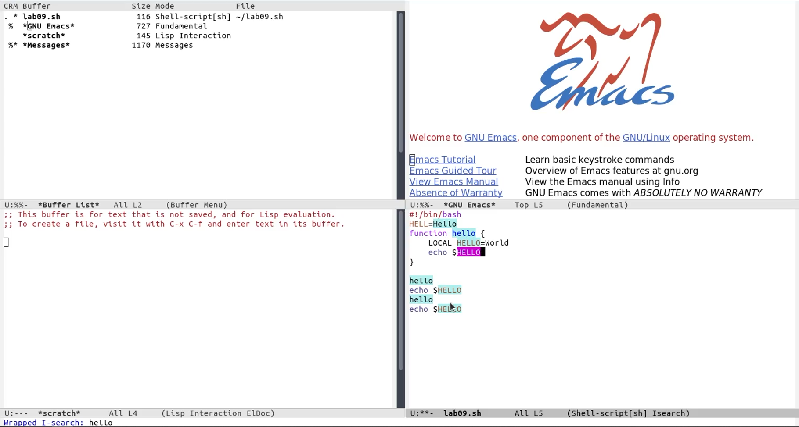
	3. Переключайтесь между результатами поиска, нажимая `C-s`.
	4. Выйдите из режима поиска, нажав `C-g`.
	5. Перейдите в режим поиска и замены (`M-%`), введите текст, который следует найти и заменить, нажмите `Enter`, затем введите текст для замены. После того как будут подсвечены результаты поиска, нажмите `!` для подтверждения замены.
	6. Испробуйте другой режим поиска, нажав `M-s o`. Объясните, чем он отличается от обычного режима?

# Вывод

В процессе работы я познакомился с операционной системой Linux. Получил практические навыки работы с редактором emacs.

# Контрольные вопросы

1. Кратко охарактеризуйте редактор emacs.
	+ Emacs представляет собой мощный экранный редактор текста, написанный на языке высокого уровня Elisp.
2. Какие особенности данного редактора могут сделать его сложным для освоения новичком?
	+ Необходимость постоянного использования различных сочетаний клавиш
3. Своими словами опишите, что такое буфер и окно в терминологии emacs’а.
	+ Буфер может содержать что угодно, например, результаты компиляции программы или встроенные подсказки. Практически всё взаимодействие с пользователем, в том числе интерактивное, происходит посредством буферов.
	+ Окно — прямоугольная область фрейма, отображающая один из буферов.
5. Можно ли открыть больше 10 буферов в одном окне?
6. Какие буферы создаются по умолчанию при запуске emacs?
7. Какие клавиши вы нажмёте, чтобы ввести следующую комбинацию `C-c |` и `C-c C-|`?
8. Как поделить текущее окно на две части?
9. В каком файле хранятся настройки редактора emacs?
10. Какую функцию выполняет клавиша и можно ли её переназначить?
11. Какой редактор вам показался удобнее в работе vi или emacs? Поясните почему.
