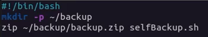
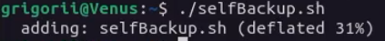
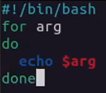
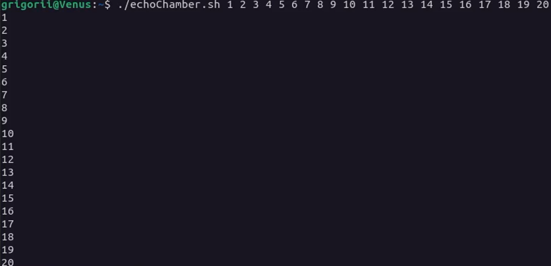
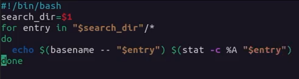
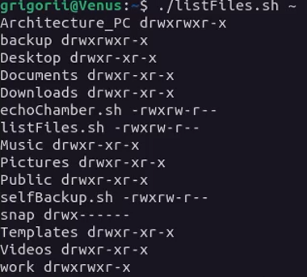
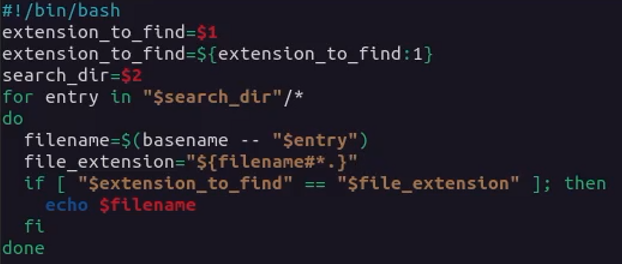
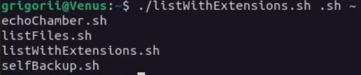


---
lang: ru-RU

fontsize: 12pt
linestretch: 1.5
papersize: a4

## Fonts
mainfont: PT Serif
romanfont: PT Serif
sansfont: PT Sans
monofont: PT Mono

---

МИНИСТЕРСТВО ОБРАЗОВАНИЯ И НАУКИ
РОССИЙСКОЙ ФЕДЕРАЦИИ

ФЕДЕРАЛЬНОЕ ГОСУДАРСТВЕННОЕ АВТОНОМНОЕ
ОБРАЗОВАТЕЛЬНОЕ УЧРЕЖДЕНИЕ ВЫСШЕГО ОБРАЗОВАНИЯ
"РОССИЙСКИЙ УНИВЕРСИТЕТ ДРУЖБЫ НАРОДОВ"

  

Факультет физико-математических и естественных наук

  

ОТЧЕТ

  

По лабораторной работе №10
"Программирование в командном процессоре ОС UNIX. Командные файлы."

  

Выполнил:
Студент группы: НПИбд-01-21
Студенческий билет: №1032211403
ФИО студента: Матюхин Григорий Васильевич
Дата выполнения: 19.05.2022

  

Москва 2022
\pagebreak

# Цель работы:

Изучить основы программирования в оболочке ОС UNIX/Linux. Научиться писать небольшие командные файлы.

# Выполнение лабораторной работы

1. Написать скрипт, который при запуске будет делать резервную копию самого себя (то есть файла, в котором содержится его исходный код) в другую директорию backup в вашем домашнем каталоге. При этом файл должен архивироваться одним из архиваторов на выбор zip, bzip2 или tar. Способ использования команд архивации необходимо узнать, изучив справку.

2. Написать пример командного файла, обрабатывающего любое произвольное число аргументов командной строки, в том числе превышающее десять. Например, скрипт может последовательно распечатывать значения всех переданных аргументов.

3. Написать командный файл — аналог команды ls (без использования самой этой команды и команды dir). Требуется, чтобы он выдавал информацию о нужном каталоге и выводил информацию о возможностях доступа к файлам этого каталога.

4. Написать командный файл, который получает в качестве аргумента командной строки формат файла (.txt, .doc, .jpg, .pdf и т.д.) и вычисляет количество таких файлов в указанной директории. Путь к директории также передаётся в виде аргумента командной строки.

# Вывод

В ходе работы я изучил основы программирования в оболочке ОС UNIX/Linux. Научился писать небольшие командные файлы.

# Контрольные вопросы

1. Объясните понятие командной оболочки. Приведите примеры командных оболочек. Чем они отличаются?
	+ Командная строка - промежуточный слой связи между пользователем и операционной системой, пользователь дает команды операционной системе через командную строку, а операционная система в свою очередь дает ответ пользователю через командную строку. Пример: POSIX, bash, zsh, cmd
2. Что такое POSIX?
	+ POSIX - стандартизированный интерфейс оболочки между пользователем и операционной системой. В теории, абсолютно все дистрибутивы выполненные на основе *nix, обладают возможностью кроссплатформенного исполнения инструкций, например инструкция для Ubuntu, MacOS, Solaris должна выглядеть одинаково при использовании гайдлайнов POSIX, отдельно все встраиваемые операционные системы обладают стандартом `POSIX Ready`, что означает почти 99% (кроме специальных инструкций, например из-за различных архитектур ОС) поддерживаемость и на других дистрибутивах с такой пометкой
3. Как определяются переменные и массивы в языке программирования bash?
	+ В `bash` могут быть определены одномерные массивы - переменные специального вида, доступ к которым осуществляется с одним именем, но с разным индексом. Для управления используются команды: `name[%n%] = value`
4. Каково назначение операторов let и read?
	+ Оператор `let` - используется для суммирования 
	+ Оператор `read` - считывает строку из стандартного ввода и разбивает на слова
5. Какие арифметические операции можно применять в языке программирования bash?
	+ `+` - сложение 
	+  `-` - вычитание
	+  `*` - умножение 
	+ `/` - деление
	+  `%` - вычисление остатка
	+  `**` - возведение в степень
	+ `+=` - декремент
	+ `-=` - инкремент
	+ `*=` - умножение на заданное число
	+ `/=` - деление на заданное число
6. Что означает операция (( ))?
	+ `(( ))` - запись условия `if-else` в оболочке `bash`
7. Какие стандартные имена переменных Вам известны?
	+ `HOME` - домашний каталог пользователя
	+  `CDPATH` - список каталогов разделенных двоеточиями и используемые при поиске пути встроенной командой `cd`
	+ `IFS` - символы, с помощью которых разделяются поля
	+ `MAIL` - если не задан `MAILPATH`, то пользователь будет информирован
	+ `MAILPATH` - список имен файлов, которые ОС периодически проверяет на наличие письма
	+ `PATH` - список каталогов, в которых командная оболочка ищет команды
8. Что такое метасимволы?
	+ `' < > * ? | \ " &` - метасимволы, которые значительно упрощают использование командной оболочки путем написания регулярных выражений
9. Как экранировать метасимволы?
	+ Экранирование осуществляется с помощью обратного слеша `\`, для выражений используются двойные кавычки, а для экранирования группы метасимволов используют одинарные кавычки
10. Как создавать и запускать командные файлы?
	+ Создаем текстовый файл с необходимой кодировкой, открываем терминал, переходим в директорию с файлов, и исполняем команду: `bash my_command [arguments]`, вводим необходимые аргументы после названия нашего файла и нажимаем Enter, так же можно изменить доступ и дать права `sudo chmod u+x my_command` и после изменения доступа можно вызывать командный файл без использования слова `bash`
11. Как определяются функции в языке программирования bash?
	+ Для создания функций используется ключевое слово `function`, после которого можно написать команды которые при исполнении файла будут исполнены в одном блоке `function`
12. Каким образом можно выяснить, является файл каталогом или обычным файлом?
	+ Заходим в терминал, пишем `ls -lrt`, смотрим вывод, если в выводе есть символ `d`, то значит что искомый нами файл является директорий (каталогом или папкой)
13. Каково назначение команд set, typeset и unset?
	+ Команда `set` - выводит список переменных окружений
	+ Команда `typeset` - ограничивает переменные (изменяет доступ, числа, массив или вообще осуществляет экспорт данных)
	+ Команда `unset` - удаляет переменную, а на самом деле устанавливает ее значение `null`
14. Как передаются параметры в командные файлы?
	+ Как аргументы командной строки
16. Назовите специальные переменные языка bash и их назначение.
	+ `$*` — отображается вся командная строка или параметры оболочки
	+  `$?` — код завершения последней выполненной команды
	+ `$$` — уникальный идентификатор процесса, в рамках которого выполняется командный процессор
	+ `$!` — номер процесса, в рамках которого выполняется последняя вызванная на выполнение в командном режиме команда
	+ `$-` — значение флагов командного процессора
	+ `${#*}` — возвращает целое число — количество слов, которые были результатом `$`
	+ `${#name}` — возвращает целое значение длины строки в переменной name
	+ `${name[n]}` — обращение к `n-му` элементу массива
	+ `${name[*]}` — перечисляет все элементы массива, разделённые пробелом
	+ `${name[@]}` — то же самое, но позволяет учитывать символы пробелы в самих переменных
	+ `${name:-value}` — если значение переменной name не определено, то оно будет заменено на указанное `value`
	+ `${name:value}` — проверяется факт существования переменной
	+ `${name=value}` — если name не определено, то ему присваивается значение `value`
	+ `${name?value}` — останавливает выполнение, если имя переменной не определено, и выводит value как сообщение об ошибке
	+ `${name+value}` — это выражение работает противоположно `${name-value}`. Если переменная определена, то подставляется `value`
	+ `${name#pattern}` — представляет значение переменной name с удалённым самым коротким левым образцом `(pattern)`
	+ `${#name[*]}` и `${#name[@]}` — эти выражения возвращают количество элементов в массиве name
