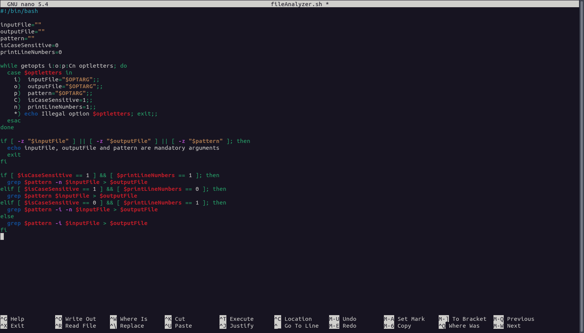
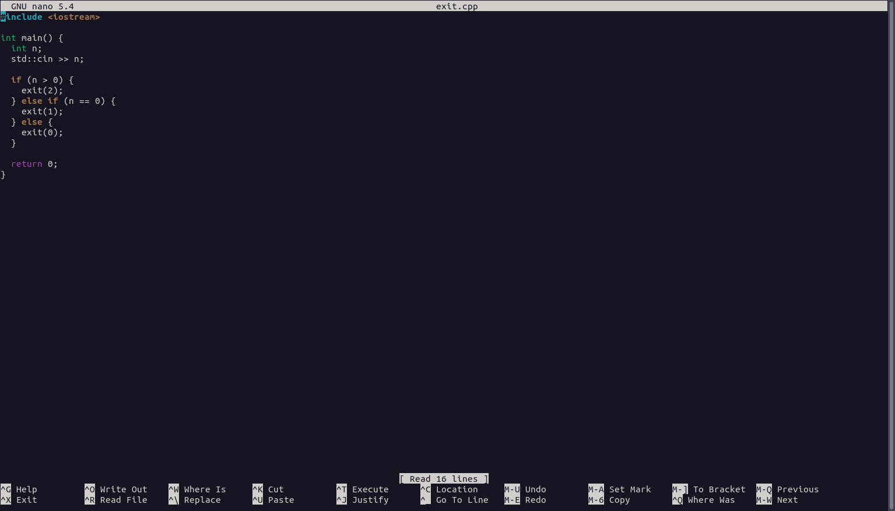
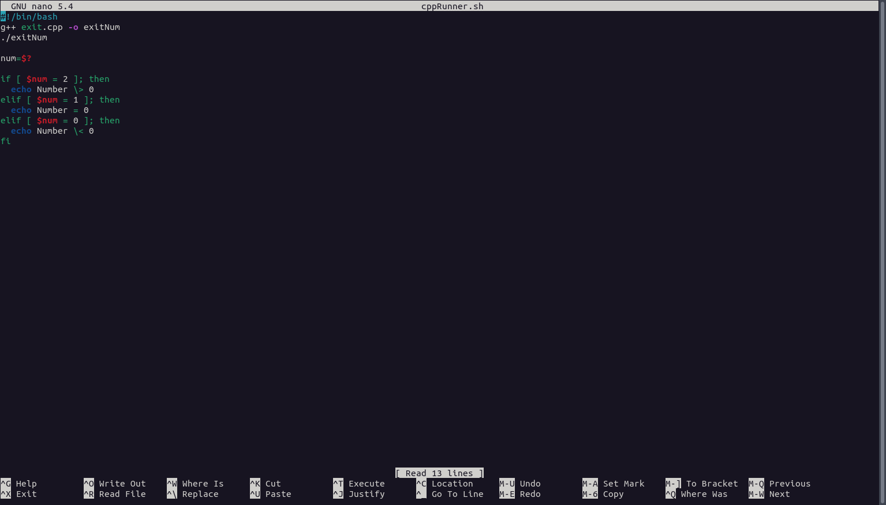
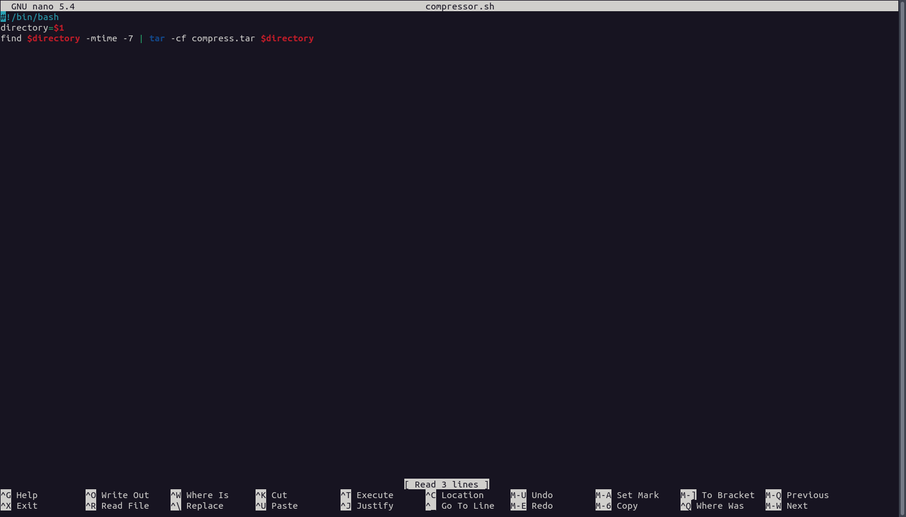

---
lang: ru-RU

fontsize: 12pt
linestretch: 1.5
papersize: a4

## Fonts
mainfont: PT Serif
romanfont: PT Serif
sansfont: PT Sans
monofont: PT Mono

---

МИНИСТЕРСТВО ОБРАЗОВАНИЯ И НАУКИ
РОССИЙСКОЙ ФЕДЕРАЦИИ

ФЕДЕРАЛЬНОЕ ГОСУДАРСТВЕННОЕ АВТОНОМНОЕ
ОБРАЗОВАТЕЛЬНОЕ УЧРЕЖДЕНИЕ ВЫСШЕГО ОБРАЗОВАНИЯ
"РОССИЙСКИЙ УНИВЕРСИТЕТ ДРУЖБЫ НАРОДОВ"

  

Факультет физико-математических и естественных наук

  

ОТЧЕТ

  

По лабораторной работе №11
"Программирование в командном процессоре ОС UNIX. Ветвления и циклы."

  

Выполнил:
Студент группы: НПИбд-01-21
Студенческий билет: №1032211403
ФИО студента: Матюхин Григорий Васильевич
Дата выполнения: 28.05.2022

  

Москва 2022
\pagebreak

# Цель работы:

Изучить основы программирования в оболочке ОС UNIX. Научится писать более сложные командные файлы с использованием логических управляющих конструкций и циклов.

# Выполнение лабораторной работы

1. Используя команды `getopts`, `grep`, написать командный файл, который анализирует командную строку с ключами:
+ `-i` — прочитать данные из указанного файла
+ `-o` — вывести данные в указанный файл
+ `-p` - шаблон — указать шаблон для поиска
+ `-C` — различать большие и малые буквы
+ `-n` — выдавать номера строк
а затем ищет в указанном файле нужные строки, определяемые ключом `-p`

2. Написать на языке Си программу, которая вводит число и определяет, является ли оно больше нуля, меньше нуля или равно нулю. Затем программа завершается с помощью функции `exit(n)`, передавая информацию в коде завершения в оболочку. Командный файл должен вызывать эту программу и, проанализировав с помощью команды `$?`, выдать сообщение о том, какое число было введено

3. Написать командный файл, создающий указанное число файлов, пронумерованных последовательно от 1 до N (например - 1.tmp, 2.tmp, 3.tmp, 4.tmp и т.д.). Число файлов, которые необходимо создать, передаётся в аргументы командной строки. Этот же командный файл должен уметь удалять все созданные им файлы (если они существуют)

4. Написать командный файл, который с помощью команды `tar` запаковывает в архив все файлы в указанной директории. Модифицировать его так, чтобы запаковывались только те файлы, которые были изменены менее недели тому назад (использовать команду `find`)

# Вывод

В ходе работы я изучил основы программирования в оболочке ОС UNIX. Научился писать более сложные командные файлы с использованием логических управляющих конструкций и циклов.

# Контрольные вопросы

1. `getpods` - эта утилита анализирует аргументы команд из исполняемого файла
2. Следующие метасимволы используют для генерации имен файлов:
+ `*` - любая или пустая последовательность символов
+ `?` - один любой символ
+ `[...]` - любой из символов указанных в квадратных скобках с перечислением или указанием диапазона
+ `cat N*` - выдает все файлы начинающиеся с `N`
+ `cat *N*` - выдает все файлы содержащие `N`
+ `cat` - выдаст все файлы с однобуквенным расширением `hello.o`, `hello.c`, но не `hello.cpp`
+ `program.?` - выдаст `program.com`
+ `cat [a-d]*` - выдаст файлы которые начинаются с буквы `a` и заканчиваются `d`
3. Операторы управления действиями - > (вывод информации), < (ввод информации), & (управляет потоком исполнения команд), && (запускает исполнения команды или команд в фоне), | (передает данные между программами), || (проверяет код завершения предыдущей команды)
4. Команда `break` служит для прерывания цикла и передает управление программой команде, которая идет следующей за циклом
5. 
+ `false` - логическое нет, отрицание, то есть дальнейшую остановку программы или переход в другую ветвь ветвления программы в зависимости от условий
+ `true` - логическое да, согласие на дальнейшее исполнение программы согласно заданным условия
6. Строка `if test -f man$s/$i.$s` означает условие для проверки существования файла `man`
7. `while` - выполняет цикл пока указанное в нем условие истинно (1, true), а `until` - выполняет цикл пока указанное в нем условие ложно (0, false)
