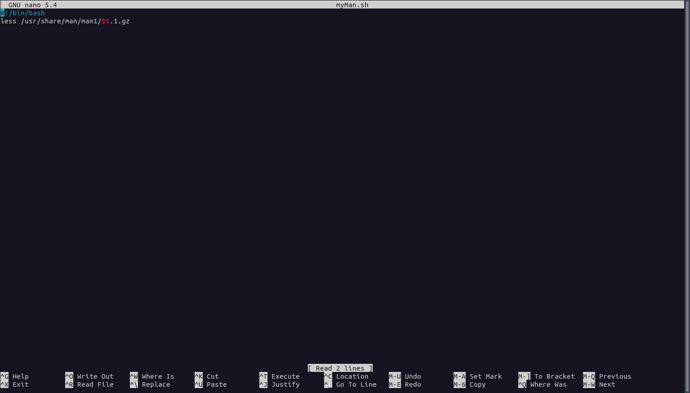

---
## Front matter
lang: ru-RU
title: Лабораторная работа №10. Программирование в командном процессоре ОС UNIX. Командные файлы.
author: Matiukhin Grigorii

## Formatting
toc: false
slide_level: 2
theme: metropolis
header-includes: 
 - \metroset{progressbar=frametitle,sectionpage=progressbar,numbering=fraction}
 - '\makeatletter'
 - '\beamer@ignorenonframefalse'
 - '\makeatother'
aspectratio: 43
section-titles: true
---

# Цель работы:

Изучить основы программирования в оболочке ОС UNIX. Научится писать более сложные командные файлы с использованием логических управляющих конструкций и циклов.

# Выполнение лабораторной работы

## Написать командный файл, реализующий упрощённый механизм семафоров. Командный файл должен в течение некоторого времени `t1` дожидаться освобождения ресурса, выдавая об этом сообщение, а дождавшись его освобождения, использовать его в течение некоторого времени `t2<>t1`, также выдавая информацию о том, что ресурс используется соответствующим командным файлом (процессом). Запустить командный файл в одном виртуальном терминале в фоновом режиме, перенаправив его вывод в другой `> /dev/tty#, где#— номер терминала куда перенаправляется вывод`, в котором также запущен этот файл, но не в фоновом, а в привилегированном режиме. Доработать программу так, чтобы имелась возможность взаимодействия трёх и более процессов

## Реализовать команду `man` с помощью командного файла. Изучите содержимое каталога `/usr/share/man/man1`. В нем находятся архивы текстовых файлов, содержащих справку по большинству установленных в системе программ и команд. Каждый архив можно открыть командой `less` сразу же просмотрев содержимое справки. Командный файл должен получать в виде аргумента командной строки название команды и в виде результата выдавать справку об этой команде или сообщение об отсутствии справки, если соответствующего файла нет в каталоге `man1`

## Используя встроенную переменную `$RANDOM`, напишите командный файл, генерирующий случайную последовательность букв латинского алфавита. Учтите, что `$RANDOM` выдаёт псевдослучайные числа в диапазоне от 0 до 32767

# Вывод

В ходе работы я изучил основы программирования в оболочке ОС UNIX. Научился писать более сложные командные файлы с использованием логических управляющих конструкций и циклов.

