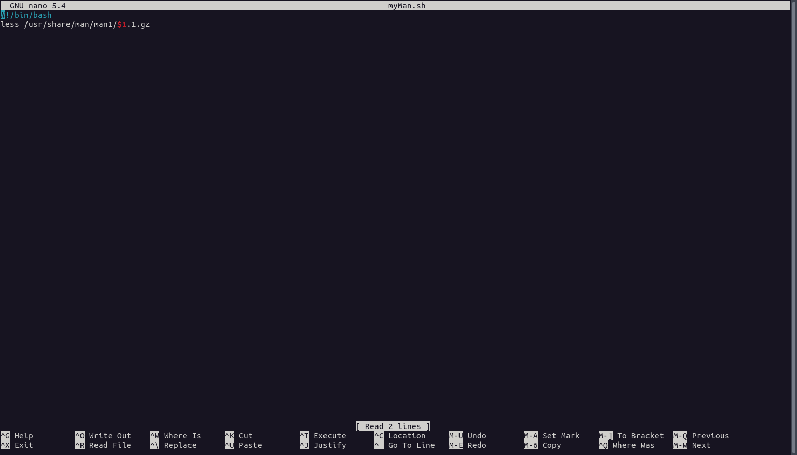
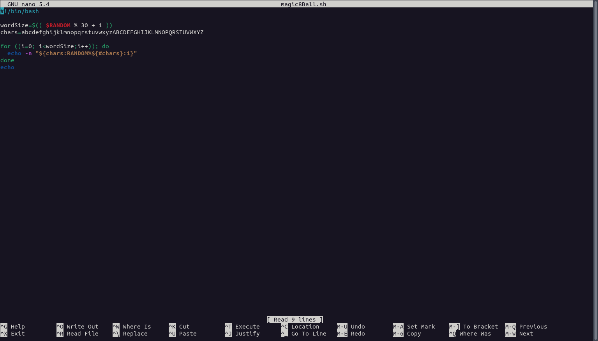

---
lang: ru-RU

fontsize: 12pt
linestretch: 1.5
papersize: a4

## Fonts
mainfont: PT Serif
romanfont: PT Serif
sansfont: PT Sans
monofont: PT Mono

---

МИНИСТЕРСТВО ОБРАЗОВАНИЯ И НАУКИ
РОССИЙСКОЙ ФЕДЕРАЦИИ

ФЕДЕРАЛЬНОЕ ГОСУДАРСТВЕННОЕ АВТОНОМНОЕ
ОБРАЗОВАТЕЛЬНОЕ УЧРЕЖДЕНИЕ ВЫСШЕГО ОБРАЗОВАНИЯ
"РОССИЙСКИЙ УНИВЕРСИТЕТ ДРУЖБЫ НАРОДОВ"

  

Факультет физико-математических и естественных наук

  

ОТЧЕТ

  

По лабораторной работе №11
"Программирование в командном процессоре ОС UNIX. Ветвления и циклы."

  

Выполнил:
Студент группы: НПИбд-01-21
Студенческий билет: №1032211403
ФИО студента: Матюхин Григорий Васильевич
Дата выполнения: 28.05.2022

  

Москва 2022
\pagebreak

# Цель работы:

Изучить основы программирования в оболочке ОС UNIX. Научится писать более сложные командные файлы с использованием логических управляющих конструкций и циклов.

# Выполнение лабораторной работы

1. Написать командный файл, реализующий упрощённый механизм семафоров. Командный файл должен в течение некоторого времени `t1` дожидаться освобождения ресурса, выдавая об этом сообщение, а дождавшись его освобождения, использовать его в течение некоторого времени `t2<>t1`, также выдавая информацию о том, что ресурс используется соответствующим командным файлом (процессом). Запустить командный файл в одном виртуальном терминале в фоновом режиме, перенаправив его вывод в другой `> /dev/tty#, где#— номер терминала куда перенаправляется вывод`, в котором также запущен этот файл, но не в фоновом, а в привилегированном режиме. Доработать программу так, чтобы имелась возможность взаимодействия трёх и более процессов

2. Реализовать команду `man` с помощью командного файла. Изучите содержимое каталога `/usr/share/man/man1`. В нем находятся архивы текстовых файлов, содержащих справку по большинству установленных в системе программ и команд. Каждый архив можно открыть командой `less` сразу же просмотрев содержимое справки. Командный файл должен получать в виде аргумента командной строки название команды и в виде результата выдавать справку об этой команде или сообщение об отсутствии справки, если соответствующего файла нет в каталоге `man1`

3. Используя встроенную переменную `$RANDOM`, напишите командный файл, генерирующий случайную последовательность букв латинского алфавита. Учтите, что `$RANDOM` выдаёт псевдослучайные числа в диапазоне от 0 до 32767

# Вывод

В ходе работы я изучил основы программирования в оболочке ОС UNIX. Научился писать более сложные командные файлы с использованием логических управляющих конструкций и циклов.

# Контрольные вопросы

1. Для правильного исполнения командной строки `while [$1 != "exit"]` квадратные скобки нужно поменять на круглые скобки
2. Использовать знак `$` между двумя переменными символьного типа для объединения нескольких строк в одно единую целую строку 
3. `seq` - выводит последовательность целых или действительных чисел для передачи в другие программы, на языке bash её можно реализовать с помощью цикла `for`
4. 10 / 3 = 3 (дробная часть будет отброшена, так как числа целые, но если бы было 10.000/3.000 = 3.333)
5. Zsh выполнен на основе bash, а поэтому наследует как недостатки так и преимущества bash, но  в zsh есть авто дополнение, горячие клавиши, алиасы, различные удобства в виде тем, плагинов и расширенной поддержке, однако есть минус всей этой красоты и удобства, на узкоспециализированных машинах это красоты быть не может в принципе из-за ограничений железа или системного администратора
6. Синтаксис верен
7. Python vs Bash
+ Плюсы Python - является полным ООП-языком программирования, значит будет меньше проблем при написании кода, а также имеет удобства в виде автозаполнения, синтаксического сахара, кроссплатформенности, подходит для автоматизирования процессов разработки ПО
+ Минусы Python - у меня при работе с ним были проблемы по части создания переменных сред исполнения кода, поэтому с этой темой надо быть аккуратнее
+ Плюсы Bash - является низкоуровневым языком программирования, что позволяет писать скрипты приближенные к синтаксису C-language, подходит больше для системного администрирования
+ Минусы Bash - не является кроссплатформенным языком для написания скриптов
