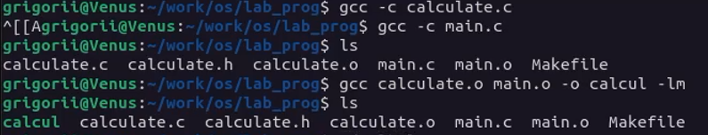
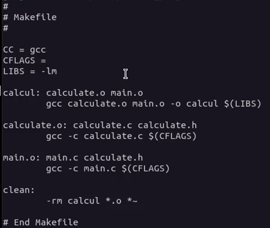
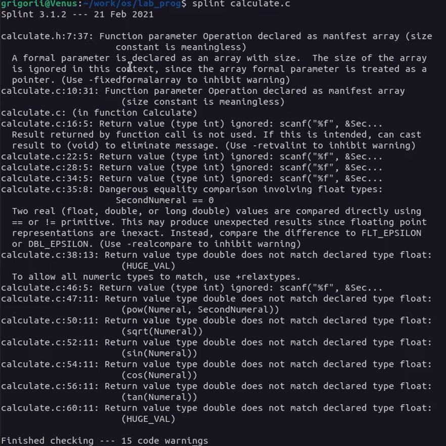
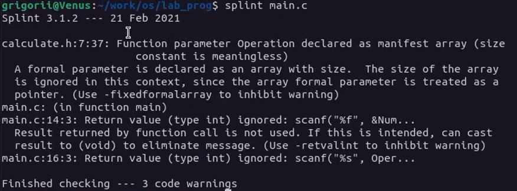

---
## Front matter
lang: ru-RU
title: Лабораторная работа №10. Программирование в командном процессоре ОС UNIX. Командные файлы.
author: Matiukhin Grigorii

## Formatting
toc: false
slide_level: 2
theme: metropolis
header-includes: 
 - \metroset{progressbar=frametitle,sectionpage=progressbar,numbering=fraction}
 - '\makeatletter'
 - '\beamer@ignorenonframefalse'
 - '\makeatother'
aspectratio: 43
section-titles: true
---
# Цель работы:

Приобрести простейшие навыки разработки, анализа, тестирования и отладки приложений в ОС типа UNIX/Linux на примере создания на языке программирования С калькулятора с простейшими функциями.

# Выполнение лабораторной работы

## Выполните компиляцию программы калькулятора посредством gcc: 

## Создайте Makefile со следующим содержанием:

## С помощью gdb выполните отладку программы calcul (перед использованием gdb исправьте Makefile):

## С помощью утилиты splint попробуйте проанализировать коды файлов calculate.c и main.c.

# Вывод

В ходе работы я приобрел простейшими навыками разработки, анализа, тестирования и отладки приложений в ОС типа UNIX/Linux на примере создания на языке программирования С калькулятора с простейшими функциями.

