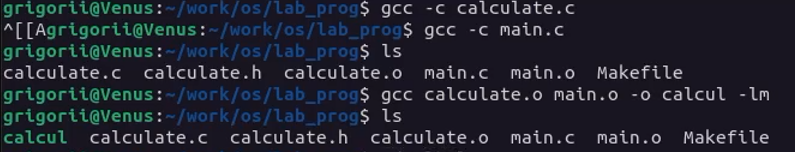
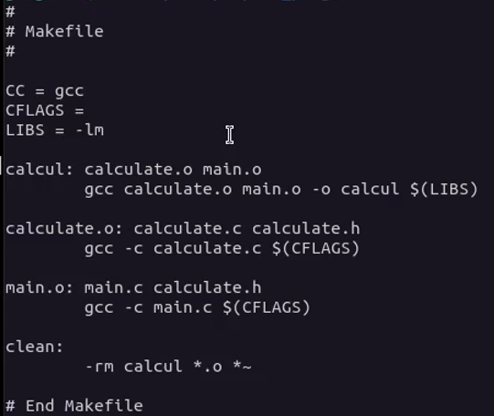
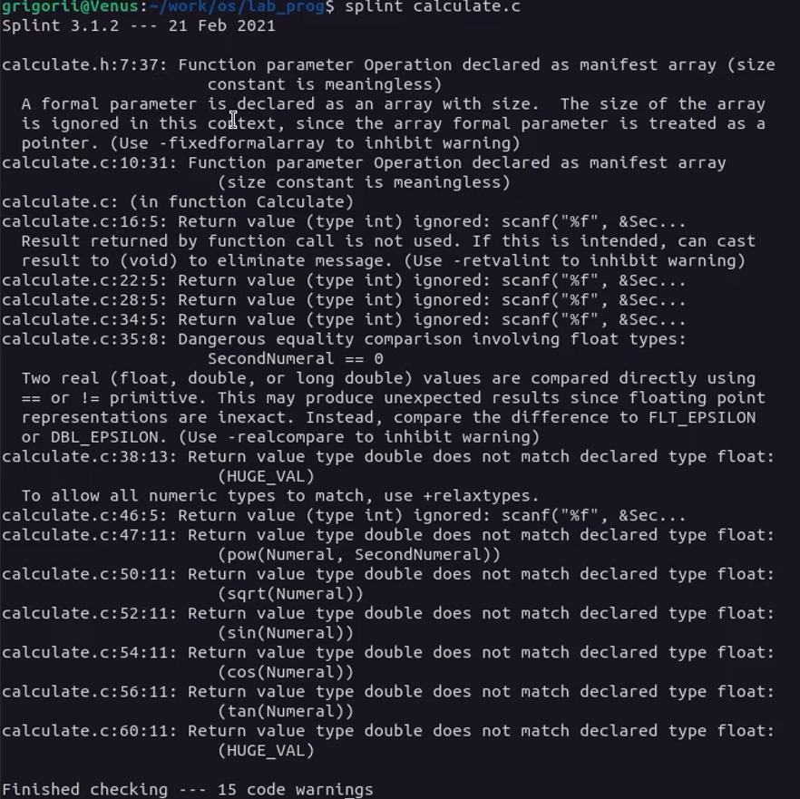
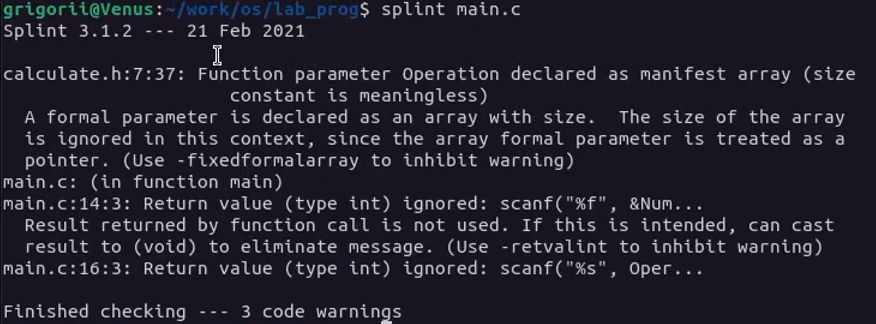

---
lang: ru-RU

fontsize: 12pt
linestretch: 1.5
papersize: a4

## Fonts
mainfont: PT Serif
romanfont: PT Serif
sansfont: PT Sans
monofont: PT Mono

---

МИНИСТЕРСТВО ОБРАЗОВАНИЯ И НАУКИ
РОССИЙСКОЙ ФЕДЕРАЦИИ

ФЕДЕРАЛЬНОЕ ГОСУДАРСТВЕННОЕ АВТОНОМНОЕ
ОБРАЗОВАТЕЛЬНОЕ УЧРЕЖДЕНИЕ ВЫСШЕГО ОБРАЗОВАНИЯ
"РОССИЙСКИЙ УНИВЕРСИТЕТ ДРУЖБЫ НАРОДОВ"

  

Факультет физико-математических и естественных наук

  

ОТЧЕТ

  

По лабораторной работе №11
"Программирование в командном процессоре ОС UNIX. Ветвления и циклы."

  

Выполнил:
Студент группы: НПИбд-01-21
Студенческий билет: №1032211403
ФИО студента: Матюхин Григорий Васильевич
Дата выполнения: 02.06.2022

  

Москва 2022
\pagebreak

# Цель работы:

Приобрести простейшие навыки разработки, анализа, тестирования и отладки приложений в ОС типа UNIX/Linux на примере создания на языке программирования С калькулятора с простейшими функциями.

# Выполнение лабораторной работы

1. В домашнем каталоге создайте подкаталог ~/work/os/lab_prog.
2. Создайте в нём файлы: calculate.h, calculate.c, main.c. Это будет примитивнейший калькулятор, способный складывать, вычитать, умножать и делить, возводить число в степень, брать квадратный корень, вычислять sin, cos, tan. При запуске он будет запрашивать первое число, операцию, второе число. После этого программа выведет результат и остановится.
3. Выполните компиляцию программы посредством gcc: 

 

4. Создайте Makefile со следующим содержанием:



6. С помощью gdb выполните отладку программы calcul (перед использованием gdb исправьте Makefile)


7. С помощью утилиты splint попробуйте проанализировать коды файлов calculate.c и main.c.




# Вывод

В ходе работы я приобрел простейшими навыками разработки, анализа, тестирования и отладки приложений в ОС типа UNIX/Linux на примере создания на языке программирования С калькулятора с простейшими функциями.

# Контрольные вопросы


1. Как получить информацию о возможностях программ gcc, make, gdb и др.?

Это можно сделать, как и для любой другой программы, с помощью `man` или через флаг `--help`.

2. Назовите и дайте краткую характеристику основным этапам разработки приложений
в UNIX.

- Написание кода в текстовом редакторе -- используется `vim` или `emacs`.
- Создание структуры компиляции программы -- используется `make` или `cmake`.
- Статическая проверка кода на ошибки -- используется `lint` или `splint`.
- Отладка программы -- используется `gdb` или `lldb`.
- Сохранение изменений -- используется `git` или `hg`.

3. Что такое суффикс в контексте языка программирования? Приведите примеры использования.

В C/C++ можно добавить к численному литералу дополнительные символы, чтобы обозначить тип данных этого литерала.
Например, по умолчанию запись `1.0` имеет тип `double`, а запись `1.0f` имеет тип `float`.
Аналогично, по умолчанию запись `123` имеет тип `int`, запись `123l` имеет тип `long int`, а запись `123u` имеет тип `unsigned int`.


4. Каково основное назначение компилятора языка С в UNIX?

Как следует из названия, он нужен для компиляции кода на языке С.
Это нужно для того, чтобы программы были портативными между системами с разными архитектурами и процессорами.

5. Для чего предназначена утилита make?

Она нужна для того, чтобы иметь одну команду для выполнения всех необходимых действий по сборке программы.
Используя собственный анализатор, `make` определяет, какие действия по сборке программы уже выполнены, а какие ещё предстоит выполнить, и делает только необходимые действия параллельно.

6. Приведите пример структуры Makefile. Дайте характеристику основным элементам этого файла.

```makefile
all: program  # указание основной цели

program: a.o b.o c.o  # указание зависимостей
    gcc -o program a.o b.o c.o  # указание команды компиляции

a.o:  # указание отдельных компонентов программы
    gcc -c a.c  # указание команды компиляции

b.o:
    gcc -c b.c

c.o:
    gcc -c c.c

clean: # указание команды для очистки всех собранных файлов
    rm -f *.o program
```


7. Назовите основное свойство, присущее всем программам отладки. Что необходимо сделать, чтобы его можно было использовать?

Все программы отладки позволяют просматривать исходный код программы, останавливать исполнение на определенных местах и рассматривать состояние
остановленной программы, если эта программа была скомпилирована с отладочной информацией (например, флагом `-g` в `GCC`).

8. Назовите и дайте основную характеристику основным командам отладчика gdb.

- `list` -- показывает исходный код программы
- `break` -- позволяет поставить точку останова на определенном месте программы
- `run` -- запускает программу
- `step` -- позволяет произвести один шаг в программе
- `next` -- позволяет произвести один шаг в программе, не заходя внутрь стека
- `finish` -- делает шаги до конца текущего фрейма стека
- `backtrace` -- показывает стек вызовов
- `display` -- позволяет просматривать значения переменных в программе

9. Опишите по шагам схему отладки программы, которую Вы использовали при выполнении лабораторной работы.

```gdb
(gdb) run
(gdb) list
(gdb) list 12,15
(gdb) list calculate.c:20,29
(gdb) break 21
(gdb) info breakpoints
(gdb) run
4
-
(gdb) backtrace
(gdb) print Numeral
(gdb) display Numeral
(gdb) info breakpoints
(gdb) delete 1
(gdb) quit
```

10. Прокомментируйте реакцию компилятора на синтаксические ошибки в программе при его первом запуске.

Он вывел сообщения, указывающие на строки с ошибками и сообщающие, что именно неожиданно об этом синтаксисе в этом месте кода.

11. Назовите основные средства, повышающие понимание исходного кода программы.

Среди таких средств можно считать функции редактора текста -- подсветку синтаксиса, автоматическую табуляцию и свертку блоков кода -- 
сообщения компилятора, если такие присутствуют, а также утилиты вроде `lint`/`splint`, которые анализируют код на частые ошибки.

12. Каковы основные задачи, решаемые программой splint?

Она обращает внимание программиста на возможные ошибки в коде, которые могут привести к неправильной работе программы в неожиданных ситуациях.
